# wyhil — Vibe Eval

> **W**hich AI model is best for **Y**our **H**uman-**I**n-the-**L**oop coding?

여러 AI 모델이 동일한 프롬프트로 바이브코딩(Vibe Coding)을 진행했을 때,  
각 모델의 결과를 구조화된 데이터로 기록하고 AI가 분석·비교 리포트를 생성하는 평가 시스템입니다.

---

## 흐름도



---

## 1. 프롬프트 작성

**담당:** 👤 관리자

모든 참여 AI 모델이 동일하게 수행할 공통 프롬프트를 작성합니다.  
`.claude/feature-definitions/{slug}.md` 파일에 저장하며, 이후 이슈 생성 시 자동으로 포함됩니다.

| 작성 항목 | 설명 |
|-----------|------|
| 공통 프롬프트 | 모든 모델이 수행할 작업 내용 |
| 평가지표 | 리뷰 시 기준이 되는 항목 |
| 프롬프트 레벨 | L1~L3 중 선택 |
| 참여 모델 | 평가에 참여할 AI 모델 목록 |

---

## 2. 이슈 생성

**담당:** 👤 관리자

작성된 프롬프트 파일을 기반으로 GitHub Issue를 생성합니다.  
이슈 하나가 하나의 평가 단위이며, 아래 내용이 자동으로 포함됩니다.

→ [이슈 생성 템플릿 보기](.claude/skills/vibe-eval/templates/issue-body.md)

| 포함 항목 | 설명 |
|-----------|------|
| 공통 프롬프트 | 모든 모델이 수행할 작업 |
| 모델별 작업 규칙 | 브랜치 네이밍, PR 제목, PR→Issue 연결 방식 |
| 제출 양식 | 바이브코딩 완료 후 PR 본문에 필수 작성 |
| 리뷰어 가이드 | 평가 양식 및 리뷰어 사용정보 |

---

## 3. 바이브코딩 요청

**담당:** 🙋 사용자

각 AI 모델에게 이슈 링크만 전달합니다.

```
{이슈 URL} 이 지시사항대로 개발해
```

| 규칙 | 내용 |
|------|------|
| 추가 프롬프트 | ❌ 금지 |
| 지침서 적용 | ✅ 허용 (LLM 사용정보에 기록) |

---

## 4. 바이브코딩 진행

**담당:** 🤖 바이브코딩 영역 (AI 모델)

이슈를 읽고 공통 프롬프트에 따라 개발을 진행한 후 PR을 생성합니다.

→ [바이브코딩 가이드 보기](.claude/skills/vibe-eval/templates/issue-body.md#바이브코딩-가이드)

| 작업 항목 | 내용 |
|-----------|------|
| 브랜치 | `vibe/{model-slug}/{slug}-{issue-number}` |
| PR 제목 | `[{모델명}] {기능명} #{issue-number}` |
| PR → Issue 연결 | `References #{N}` 사용 (`Closes` 아님) |
| PR 생성 전 필수 | LLM 사용정보 작성 후 PR 본문 또는 세션 파일에 포함 |

---

## 5. 리뷰 요청

**담당:** 🙋 사용자

바이브코딩을 수행한 모델과 **다른** 모델에게 리뷰를 요청합니다.

```
{PR URL} 리뷰 진행해줘
```

---

## 6. 리뷰 진행

**담당:** 🤖 바이브코딩 영역 (AI 모델)

PR을 읽고 이슈의 평가지표를 기준으로 평가서를 작성한 뒤 PR 댓글로 등록합니다.

→ [리뷰어 템플릿 보기](.claude/skills/vibe-eval/templates/review-body.md)

| 작업 항목 | 내용 |
|-----------|------|
| 평가 기준 | 공통 프롬프트 기반 — 이슈 내 리뷰어 가이드 참고 |
| 제출 방식 | PR 댓글로 평가서 등록 |
| 리뷰 완료 후 필수 | LLM 사용정보 작성 후 댓글에 포함 |

---

## 7. 리포트 생성

**담당:** 👤 관리자

모든 모델의 PR 및 리뷰가 완료되면 Issue를 수동으로 종료하고 리포트를 생성합니다.  
Issue에 연결된 PR과 세션 기록을 분석하여 모델별 비교 리포트를 작성합니다.

→ [리포트 생성 가이드](.claude/skills/vibe-eval/report.md)

결과물: `reports/{slug}-{issue-number}/comparison.md`

---

## 참여 모델

<!-- VIBE-MODELS-START -->
| 모델 | 브랜치 | 계정 |
|------|--------|------|
| Claude | `claude` | @HojinJava |
| Wyhill | `wyhill` | - |
| Wyhill+지침서 | `wyhill-guide` | @HojinJava |
| 안티그래비티 | `antigravity` | - |
| Codex | `codex` | - |
<!-- VIBE-MODELS-END -->

---

## 디렉터리 구조

```
repo/
├── {project}/                            ← 실제 프로젝트 코드
├── .gitignore
├── README.md
└── claude/                               ← 평가 관련 파일 일체
    ├── feature-definitions/              ← 공통 프롬프트 정의서
    │   └── {slug}.md
    ├── vibe-sessions/                    ← 모델별 세션 기록
    │   └── {slug}-{issue-number}/
    │       ├── claude.md
    │       ├── wyhill.md
    │       ├── wyhill-guide.md
    │       ├── cortex-code.md
    │       └── antigravity.md
    └── reports/                          ← 생성된 비교 리포트
        └── {slug}-{issue-number}/
            ├── claude.md
            ├── wyhill.md
            └── comparison.md
```

---

## 관리자 기능

Claude Code에서 `/명령어`로 실행하는 프로젝트 전용 관리 커맨드입니다.

| 커맨드 | 사용법 | 설명 |
|--------|--------|------|
| `/model` | `/model` | 등록된 모델 목록 및 브랜치 확인 |
| `/model add` | `/model add <key>` | 새 모델 등록 + 브랜치 자동 생성 + GitHub 라벨 생성 |
| `/model del` | `/model del <key>` | 모델 삭제 (브랜치 삭제 여부 선택 가능) |
| `/user-mapping` | `/user-mapping` | 미매핑 협업자를 모델에 연결 |
| `/user-mapping del` | `/user-mapping del <github-user>` | 계정 매핑 해제 |
| `/add-project` | `/add-project` | 프로젝트 등록 (alias + 폴더명) |
| `/add-project del` | `/add-project del <alias>` | 프로젝트 삭제 |
| `/w-create-issue` | `/w-create-issue` | 이슈 생성 마법사 (프로젝트·레벨·프롬프트·모델 선택) |

모델 정보는 `.github/vibe-models.json`에서 관리됩니다.

---

## 자동화 (GitHub Actions)

### PR 유효성 검사 — `vibe-pr-validation.yml`

`vibe/*` 브랜치로 PR이 열릴 때마다 자동 실행됩니다.

| 검사 항목 | 내용 | 실패 시 |
|-----------|------|---------|
| 모델 등록 여부 | 브랜치의 모델 키가 `vibe-models.json`에 등록되어 있는지 | PR 자동 close |
| 대상 브랜치 | PR base가 해당 모델의 전용 브랜치인지 (`vibe/claude/...` → `claude`) | PR 자동 close |
| 작성자 계정 | PR 작성자가 해당 모델에 등록된 계정인지 (계정 미설정 시 생략) | PR 자동 close |

실패 시 PR에 사유 코멘트가 자동으로 등록되고, PR Checks에 ❌ 로 표시됩니다.  
브랜치는 삭제되지 않으며 수정 후 재시도할 수 있습니다.

> 계정 등록은 `/user-mapping`, 모델 등록은 `/model add` 커맨드를 사용합니다.