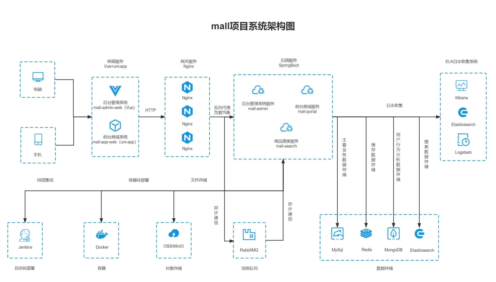
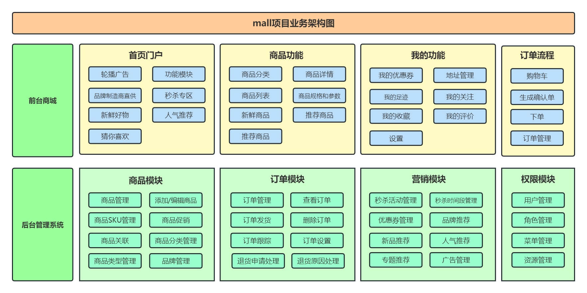
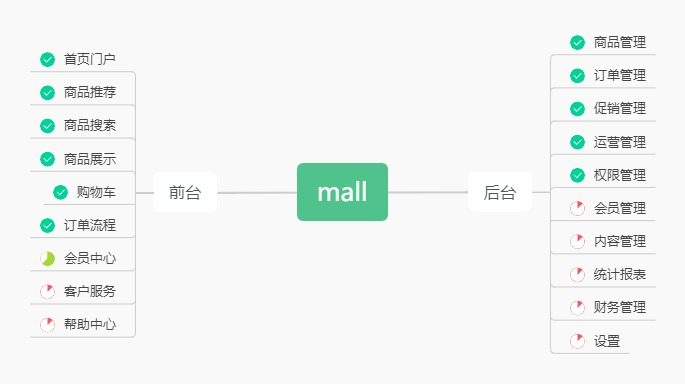

# mall

<p>
  <a href="#공식채널"></a>
  <a href="#공식채널"></a>
  <a href="https://github.com/macrozheng/mall-learning"></a>
  <a href="https://github.com/macrozheng/mall-swarm"></a>
  <a href="https://github.com/macrozheng/mall-admin-web"></a>
  <a href="https://github.com/macrozheng/mall-app-web"></a>
  <a href="https://gitee.com/macrozheng/mall"></a>
</p>

## 안내

> 1. **프로젝트 바로 체험**: [온라인 데모](https://www.macrozheng.com/admin/index.html)
> 2. **전체 학습 튜토리얼**: [《mall 학습 튜토리얼》](https://www.macrozheng.com)
> 3. **동영상 강좌**: [《mall 동영상 튜토리얼》](https://www.macrozheng.com/mall/foreword/mall_video.html)
> 4. **마이크로서비스 버전**: Spring Cloud Alibaba 기반 프로젝트: [mall-swarm](https://github.com/macrozheng/mall-swarm)
> 5. **브랜치 안내**: `master` 브랜치는 Spring Boot 2.7 + JDK 8 기반, `dev-v3` 브랜치는 Spring Boot 3.2 + JDK 17 기반입니다.

## 소개

`mall` 프로젝트는 완전한 전자상거래 시스템 구축을 목표로 하며, 현 시점의 주류 기술을 활용하여 구현되었습니다.

## 프로젝트 문서

문서 주소: [https://www.macrozheng.com](https://www.macrozheng.com)

## 프로젝트 설명

`mall` 프로젝트는 전자상거래 시스템으로, 고객 쇼핑몰과 관리자 백오피스 시스템을 포함합니다. Spring Boot + MyBatis 기반으로 구현되었으며, Docker 컨테이너 배포를 지원합니다.

**고객 쇼핑몰**은 홈 페이지, 상품 추천, 상품 검색, 상품 상세, 장바구니, 주문 프로세스, 회원 센터, 고객 서비스, 도움말 모듈을 포함합니다.

**관리자 백오피스**는 상품 관리, 주문 관리, 회원 관리, 판촉 관리, 운영 관리, 콘텐츠 관리, 통계 리포트, 재무 관리, 권한 관리, 설정 모듈을 포함합니다.

### 데모

#### 관리자 시스템

프론트엔드 프로젝트 `mall-admin-web`: https://github.com/macrozheng/mall-admin-web

데모 주소: [https://www.macrozheng.com/admin/index.html](https://www.macrozheng.com/admin/index.html)


#### 고객 쇼핑몰 시스템

프론트엔드 프로젝트 `mall-app-web`: https://github.com/macrozheng/mall-app-web

데모 주소 (브라우저를 모바일 모드로 전환하면 더 잘 보입니다): [https://www.macrozheng.com/app/](https://www.macrozheng.com/app/)


### 모듈 구성

```lua
mall
├── mall-common  -- 유틸 클래스 및 공용 코드
├── mall-mbg     -- MyBatisGenerator 생성 데이터베이스 작업 코드
├── mall-security -- SpringSecurity 공용 모듈
├── mall-admin   -- 백오피스 관리 시스템 API
├── mall-search  -- Elasticsearch 기반 상품 검색 시스템
├── mall-portal  -- 고객 쇼핑몰 시스템 API
└── mall-demo    -- 프레임워크 구성 테스트 코드
```

### 기술 스택

#### 백엔드 기술

| 기술 | 설명 | 공식 사이트 |
| ---- | ---- | ---------- |
| SpringBoot | 웹 애플리케이션 개발 프레임워크 | https://spring.io/projects/spring-boot |
| SpringSecurity | 인증 및 인가 프레임워크 | https://spring.io/projects/spring-security |
| MyBatis | ORM 프레임워크 | http://www.mybatis.org/mybatis-3/zh/index.html |
| MyBatisGenerator | 데이터 계층 코드 생성기 | http://www.mybatis.org/generator/index.html |
| Elasticsearch | 검색 엔진 | https://github.com/elastic/elasticsearch |
| RabbitMQ | 메시지 큐 | https://www.rabbitmq.com/ |
| Redis | 인메모리 데이터 스토어 | https://redis.io/ |
| MongoDB | NoSQL 데이터베이스 | https://www.mongodb.com |
| LogStash | 로그 수집 도구 | https://github.com/elastic/logstash |
| Kibana | 로그 시각화 도구 | https://github.com/elastic/kibana |
| Nginx | 정적 리소스 서버 | https://www.nginx.com/ |
| Docker | 애플리케이션 컨테이너 엔진 | https://www.docker.com |
| Jenkins | 자동화 배포 도구 | https://github.com/jenkinsci/jenkins |
| Druid | 데이터베이스 커넥션 풀 | https://github.com/alibaba/druid |
| OSS | 객체 스토리지 (Aliyun) | https://github.com/aliyun/aliyun-oss-java-sdk |
| MinIO | 객체 스토리지 (자체 호스팅) | https://github.com/minio/minio |
| JWT | JWT 로그인 지원 | https://github.com/jwtk/jjwt |
| Lombok | Java 언어 확장 라이브러리 | https://github.com/rzwitserloot/lombok |
| Hutool | Java 유틸리티 라이브러리 | https://github.com/looly/hutool |
| PageHelper | MyBatis 물리 페이징 플러그인 | http://git.oschina.net/free/Mybatis_PageHelper |
| Swagger-UI | API 문서 생성 도구 | https://github.com/swagger-api/swagger-ui |
| Hibernator-Validator | 검증 프레임워크 | http://hibernate.org/validator |

#### 프론트엔드 기술

| 기술 | 설명 | 공식 사이트 |
| ---- | ---- | ---------- |
| Vue | 프론트엔드 프레임워크 | https://vuejs.org/ |
| Vue-router | 라우팅 프레임워크 | https://router.vuejs.org/ |
| Vuex | 전역 상태 관리 프레임워크 | https://vuex.vuejs.org/ |
| Element | 프론트엔드 UI 프레임워크 | https://element.eleme.io |
| Axios | HTTP 클라이언트 | https://github.com/axios/axios |
| v-charts | Echarts 기반 차트 프레임워크 | https://v-charts.js.org/ |
| Js-cookie | 쿠키 관리 도구 | https://github.com/js-cookie/js-cookie |
| nprogress | 진행바 컴포넌트 | https://github.com/rstacruz/nprogress |

#### 모바일 기술

| 기술 | 설명 | 공식 사이트 |
| ---- | ---- | ---------- |
| Vue | 핵심 프론트엔드 프레임워크 | https://vuejs.org |
| Vuex | 전역 상태 관리 프레임워크 | https://vuex.vuejs.org |
| uni-app | 모바일 크로스플랫폼 프레임워크 | https://uniapp.dcloud.io |
| mix-mall | 쇼핑몰 프로젝트 템플릿 | https://ext.dcloud.net.cn/plugin?id=200 |
| luch-request | HTTP 요청 프레임워크 | https://github.com/lei-mu/luch-request |

#### 아키텍처 다이어그램

##### 시스템 아키텍처



##### 비즈니스 아키텍처



#### 모듈 소개

##### 관리자 시스템 `mall-admin`

- 상품 관리: [기능 구조도-상품](document/resource/mind_product.jpg)
- 주문 관리: [기능 구조도-주문](document/resource/mind_order.jpg)
- 판촉 관리: [기능 구조도-판촉](document/resource/mind_sale.jpg)
- 콘텐츠 관리: [기능 구조도-콘텐츠](document/resource/mind_content.jpg)
- 회원 관리: [기능 구조도-회원](document/resource/mind_member.jpg)

##### 고객 쇼핑몰 시스템 `mall-portal`

[기능 구조도-고객 쇼핑몰](document/resource/mind_portal.jpg)

#### 개발 진행 현황



---

## 환경 구성

### 개발 도구

| 도구 | 설명 | 공식 사이트 |
| ---- | ---- | ---------- |
| IDEA | 개발 IDE | https://www.jetbrains.com/idea/download |
| RedisDesktop | Redis 클라이언트 | https://github.com/qishibo/AnotherRedisDesktopManager |
| Robomongo | MongoDB 클라이언트 | https://robomongo.org/download |
| SwitchHosts | 로컬 hosts 관리 | https://oldj.github.io/SwitchHosts/ |
| X-shell | Linux 원격 접속 도구 | http://www.netsarang.com/download/software.html |
| Navicat | 데이터베이스 클라이언트 | http://www.formysql.com/xiazai.html |
| PowerDesigner | 데이터베이스 설계 도구 | http://powerdesigner.de/ |
| Axure | 프로토타입 설계 도구 | https://www.axure.com/ |
| MindMaster | 마인드맵 도구 | http://www.edrawsoft.cn/mindmaster |
| ScreenToGif | GIF 녹화 도구 | https://www.screentogif.com/ |
| ProcessOn | 플로우차트 도구 | https://www.processon.com/ |
| PicPick | 이미지 편집 도구 | https://picpick.app/zh/ |
| Snipaste | 스크린샷 도구 | https://www.snipaste.com/ |
| Postman | API 테스트 도구 | https://www.postman.com/ |
| Typora | Markdown 편집기 | https://typora.io/ |

### 개발 환경

| 도구 | 버전 | 다운로드 |
| ---- | ---- | -------- |
| JDK | 1.8 | https://www.oracle.com/technetwork/java/javase/downloads/jdk8-downloads-2133151.html |
| MySQL | 5.7 | https://www.mysql.com/ |
| Redis | 7.0 | https://redis.io/download |
| MongoDB | 5.0 | https://www.mongodb.com/download-center |
| RabbitMQ | 3.10.5 | http://www.rabbitmq.com/download.html |
| Nginx | 1.22 | http://nginx.org/en/download.html |
| Elasticsearch | 7.17.3 | https://www.elastic.co/downloads/elasticsearch |
| Logstash | 7.17.3 | https://www.elastic.co/cn/downloads/logstash |
| Kibana | 7.17.3 | https://www.elastic.co/cn/downloads/kibana |

### 구성 단계

> Windows 환경 배포

- Windows 환경 구성 참고: [mall 프로젝트 백엔드 개발 환경 구성](https://www.macrozheng.com/mall/start/mall_deploy_windows.html)
- 참고: `mall-admin` 모듈만 실행 시 MySQL과 Redis만 설치하면 됩니다.
- `mall-admin-web` 프로젝트 클론 후 IDEA에서 컴파일: [프론트엔드 프로젝트 주소](https://github.com/macrozheng/mall-admin-web)
- `mall-admin-web` 설치 및 배포 참고: [mall 프로젝트 프론트엔드 개발 환경 구성](https://www.macrozheng.com/mall/start/mall_deploy_web.html)

> Docker 환경 배포

- CentOS 7.6 가상머신 설치 참고: [가상머신 설치 및 Linux 사용 가이드](https://www.macrozheng.com/mall/deploy/linux_install.html)
- Docker 이미지 빌드 참고: [Maven 플러그인으로 SpringBoot Docker 이미지 빌드](https://www.macrozheng.com/project/maven_docker_fabric8.html)
- Docker 컨테이너 배포 참고: [mall Linux 환경 배포 (Docker 컨테이너 기반)](https://www.macrozheng.com/mall/deploy/mall_deploy_docker.html)
- Docker Compose 배포 참고: [mall Linux 환경 배포 (Docker Compose 기반)](https://www.macrozheng.com/mall/deploy/mall_deploy_docker_compose.html)
- Jenkins 자동 배포 참고: [mall Linux 환경 자동화 배포 (Jenkins 기반)](https://www.macrozheng.com/mall/deploy/mall_deploy_jenkins.html)

---

## 공식 채널

WeChat 그룹 참여는 공식 계정 **「macrozheng」** 팔로우 후 **「加群」** 으로 답장하세요.


## 라이선스

[Apache License 2.0](https://github.com/macrozheng/mall/blob/master/LICENSE)

Copyright (c) 2018-2026 macrozheng
