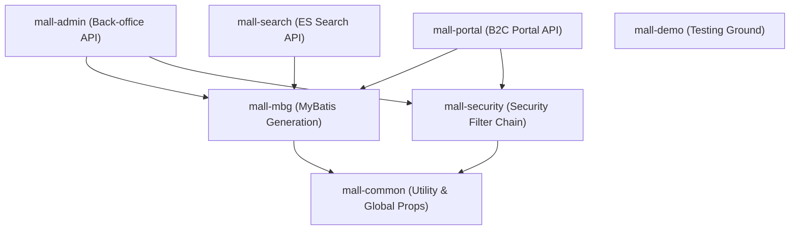

# mall - Codebase Documentation (by Antigravity)

## 1. 프로젝트 개요

`mall` 프로젝트는 현대적인 엔터프라이즈 쇼핑몰 시스템의 정수를 담은 오픈소스 프레임워크입니다. 단순히 기능을 구현하는 것을 넘어, 확장 가능한 **Multi-Module 아키텍처**와 검증된 기술 스택을 활용하여 B2C(Business to Consumer) 포털과 관리자(Back-office) 시스템을 동시에 제공합니다. 

이 프로젝트는 개발자가 실제 상용 수준의 전자상거래 도메인(상품, 주문, 프로모션, 권한 등)을 심도 있게 이해하고, 데이터베이스 중심의 개발 패턴에서 탈피하여 효율적인 코드 생성 및 검색 엔진 연동 등의 고급 기술을 실무에 적용하는 방법을 제시합니다.

## 2. 기술 스택 및 의존성

| 구분 | 기술 스택 | 상세 설명 |
| :--- | :--- | :--- |
| **Backend** | Spring Boot 2.7.5 | 어플리케이션 코어 및 생태계 관리 |
| **ORM / Data** | MyBatis 3.5+, MySQL 8.0, Druid | 정교한 SQL 제어 및 커넥션 풀링 |
| **Security** | Spring Security + JWT | 무상태(Stateless) 기반의 보안 아키텍처 |
| **Search** | Elasticsearch 7.17 | 대용량 상품 데이터의 고속 검색 |
| **Cache / NoSQL** | Redis 7.0, MongoDB 5.0 | 캐싱 및 비정형 로그 데이터 처리 |
| **Messaging** | RabbitMQ 3.10 | 서비스 간 비동기 연동 및 지연 처리 |
| **Storage** | MinIO / Aliyun OSS | 분산 객체 스토리지 연동 |
| **Utility** | Hutool, Lombok, PageHelper | 개발 생산성 극대화 도구 |

## 3. 프로젝트 구조

멀티 모듈 구조를 통해 코드의 재사용성을 극대화하고 책임 소재를 명확히 분리합니다.

*   **mall-common**: 공통 예외 처리(`GlobalExceptionHandler`), API 공통 응답(`CommonResult`), 유틸리티 및 로깅 AOP 포함.
*   **mall-mbg**: MyBatis Generator를 통해 테이블 구조와 동기화된 Model과 Mapper 생성.
*   **mall-security**: JWT 기반 인증 로직을 캡슐화하여 각 API 모듈에 보안 기능 주입.
*   **mall-admin**: 상품/주문/마케팅 관리 등 운영 업무를 위한 REST API.
*   **mall-portal**: 일반 회원의 쇼핑, 결제, 마이페이지 처리를 위한 API.

## 4. 핵심 아키텍처

1.  **Modular Monolith**: 논리적으로는 모듈이 분리되어 있으나, 관리 편의성을 위해 단일 코드베이스에서 관리되는 형태입니다. 이는 추후 MSA(Microservices Architecture)로의 전환을 용이하게 합니다.
2.  **State-of-the-art Search Strategy**: 조회 성능이 중요한 상품 검색은 `mall-search` 모듈에서 Elasticsearch를 통해 처리하며, 데이터 동기화는 별도의 로직을 통해 구현됩니다.
3.  **Encapsulated Security**: `CommonSecurityConfig`를 통해 보안 설정을 추상화하여, 새로운 API 모듈을 추가할 때 복잡한 설정 없이도 일관된 보안 정책을 적용할 수 있습니다.
4.  **Automated CRUD Layer**: `Example` 객체를 활용한 동적 쿼리 생성을 통해 단순 CRUD 반복 작업을 90% 이상 제거했습니다.

## 5. 주요 파일 및 모듈 분석

### `mall-admin / controller`
*   `PmsProductController`: 상품 관리의 핵심. 복잡한 상품 속성 및 카테고리 연동을 처리합니다.
*   `OmsOrderController`: 주문 상태 변경 및 배송 처리를 관리합니다.

### `mall-security / component`
*   `JwtAuthenticationTokenFilter`: 모든 요청의 Header에서 JWT를 추출하고 검증하는 핵심 필터입니다.
*   `RestfulAccessDeniedHandler`: 권한 부족 시 JSON 형태의 공통 응답을 반환합니다.

### `mall-common / api / CommonResult`
*   모든 API의 표준 응답 포맷을 정의하여 프론트엔드와의 통신 규약 일관성을 보장합니다.

## 6. 코드 품질 분석

*   **우수성 (Strengths)**:
    *   **관심사 분리**: 도메인(Model)과 API(DTO)를 분리하여 데이터베이스 변경이 외부에 직접 노출되지 않도록 설계됨.
    *   **확장성**: `mall-common`과 `mall-security`를 통한 인프라스트럭처 수준의 공통 모듈화가 잘 되어 있음.
    *   **문서 자동화**: Swagger3 통합을 통해 API 스펙 관리가 실시간으로 이루어짐.
*   **개선 필요점 (Weaknesses)**:
    *   **테스트 커버리지**: 비즈니스 로직에 대한 JUnit 단위 테스트가 부족하여 리팩토링 시 안정성 확보가 필요함.
    *   **순환 참조 위험**: 모듈 간 의존성이 복잡해질 경우 빌드 타임에 순환 참조가 발생할 가능성이 존재함.

## 7. 개선 로드맵

1.  **JDK 17 + Spring Boot 3.x 마이그레이션**: Jakarta EE 전환 및 가상 스레드(Virtual Threads) 도입을 통한 성능 향상.
2.  **Observability 강화**: Prometheus와 Grafana를 연동하여 시스템 모니터링 및 메트릭 수집 체계 구축.
3.  **Test-Driven Development**: 주요 핵심 로직(결제, 재고 차감 등)에 대한 테스트 코드 강제화를 통해 코드 무결성 확보.
4.  **External Config**: Spring Cloud Config나 Nacos를 통한 설정 파일의 중앙 집중식 관리.

## 8. 개발 가이드

1.  **환경 설정**: Docker Compose를 활용하여 `docker-compose up -d` 명령어로 모든 인프라(MySQL, Redis 등)를 한 번에 기동할 수 있습니다.
2.  **데이터베이스 변경**: `mall-mbg` 모듈의 `generatorConfig.xml`을 수정하고 Maven 플러그인을 실행하여 엔티티와 기본 매퍼를 갱신하십시오.
3.  **권한 제어**: 새로운 API에 권한을 추가하려면 데이터베이스의 `ums_permission` 테이블에 URL을 등록하거나, 컨트롤러에 `@PreAuthorize` 어노테이션을 사용하십시오.

## 9. AI 어시스턴트 참고 섹션 (AI Assistant Reference Section)

*   **Contextual Dependency**: 코드를 제안할 때, 해당 로직이 `mall-admin`인지 `mall-portal`인지 명확히 구분해야 합니다. 공통 로직은 반드시 `mall-common`에 위치시켜야 합니다.
*   **Mapper Modification**: `mall-mbg`에서 자동 생성된 XML 파일(`*Mapper.xml`)을 직접 수정하지 마십시오. 대신 `dao` 패키지에 커스텀 매퍼 인터페이스와 XML을 생성하여 기능을 확장하십시오.
*   **Standard Result Pattern**: 모든 응답은 `return CommonResult.success(data)` 또는 `CommonResult.failed()` 형식을 준수해야 하며, 예외 발생 시 직접 인스턴스를 생성하기보다 `Asserts.fail()`을 활용하여 전역 예외 처리기가 작동하도록 유도하십시오.
*   **DTO vs Entity**: 데이터베이스 엔티티를 컨트롤러의 응답값으로 직접 반환하지 마십시오. 반드시 `DTO` 객체를 생성하여 필요한 필드만 노출하도록 제안하십시오.
