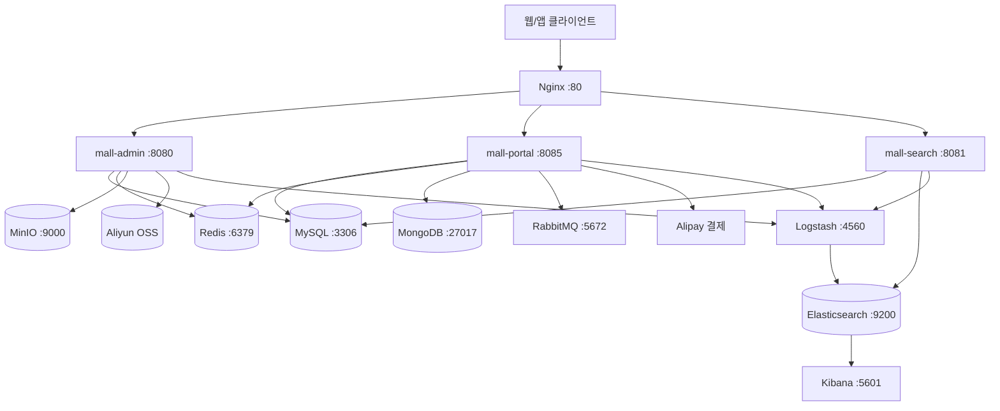
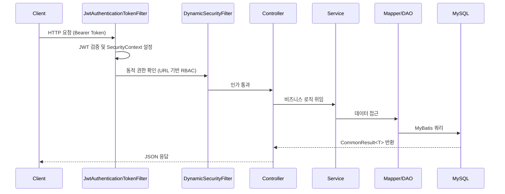
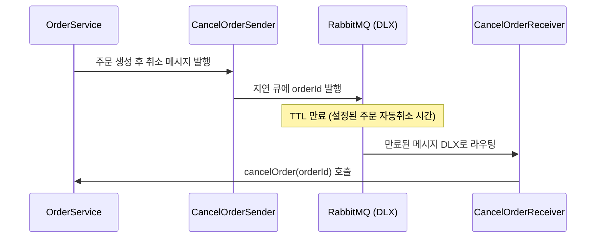

# mall - Codebase Documentation

## 1. 프로젝트 개요

mall은 Spring Boot 기반의 풀스택 전자상거래(이커머스) 백엔드 플랫폼이다. 관리자 백오피스(`mall-admin`), 고객 API 서버(`mall-portal`), 검색 서비스(`mall-search`) 세 개의 독립 배포 가능한 서비스로 구성되며, 공통 모듈(`mall-common`, `mall-security`, `mall-mbg`)을 공유한다.

도메인 설계는 중국 전자상거래 도메인 관례를 따르며 PMS(Product), OMS(Order), SMS(Sales/Promotion), UMS(User), CMS(Content) 다섯 개 도메인으로 분류된다.

| 항목 | 내용 |
|------|------|
| 언어 | Java 1.8 |
| 프레임워크 | Spring Boot 2.7.5 |
| 빌드 도구 | Maven (멀티 모듈) |
| 아키텍처 | 모놀리식 멀티모듈 (서비스별 독립 배포) |
| 라이선스 | LICENSE 파일 참조 |

---

## 2. 기술 스택 및 의존성

### 핵심 프레임워크

| 분류 | 기술 | 버전 |
|------|------|------|
| 웹 프레임워크 | Spring Boot | 2.7.5 |
| ORM | MyBatis | 3.5.10 |
| 페이징 | PageHelper Spring Boot Starter | 1.4.5 |
| 코드 생성 | MyBatis Generator | 1.4.1 |
| 커넥션 풀 | Druid | 1.2.14 |
| DB | MySQL | 8.0.29 드라이버 (서버 5.7) |

### 캐싱 및 메시징

| 분류 | 기술 | 비고 |
|------|------|------|
| 캐시 | Redis 7 | Spring Data Redis |
| 메시지 큐 | RabbitMQ 3.9.11 | 주문 취소 비동기 처리 |
| 검색 엔진 | Elasticsearch 7.17.3 | Spring Data Elasticsearch |
| NoSQL | MongoDB 4 | 사용자 행동 데이터 |

### 보안 및 인증

| 분류 | 기술 | 비고 |
|------|------|------|
| 보안 프레임워크 | Spring Security | |
| 토큰 | JWT (jjwt 0.9.1) | Bearer 방식, 7일 만료 |
| 권한 | 동적 URL 기반 RBAC | |

### 스토리지 및 외부 서비스

| 분류 | 기술 | 비고 |
|------|------|------|
| 오브젝트 스토리지 | MinIO 8.4.5 | 로컬/자체 호스팅 |
| 클라우드 스토리지 | Aliyun OSS 2.5.0 | 알리바바 클라우드 |
| 결제 | Alipay SDK 4.38.61 | 샌드박스 지원 |

### 유틸리티 및 인프라

| 분류 | 기술 | 비고 |
|------|------|------|
| Java 유틸 | Hutool 5.8.9 | |
| 코드 간소화 | Lombok | |
| API 문서 | Springfox Swagger 3.0.0 | |
| 로깅 파이프라인 | Logstash Logback Encoder 7.2 | ELK 스택 연동 |
| 컨테이너 | Docker + docker-maven-plugin 0.40.2 | |
| 리버스 프록시 | Nginx 1.22 | |
| 로그 시각화 | Kibana 7.17.3 | |

---

## 3. 프로젝트 구조

```
mall/
├── pom.xml                        # 루트 POM (멀티모듈 관리)
├── mall-common/                   # 공통 유틸 모듈
│   └── src/main/java/com/macro/mall/common/
│       ├── api/                   # CommonResult, CommonPage, ResultCode
│       ├── config/                # Redis, Swagger 기본 설정
│       ├── domain/                # WebLog, SwaggerProperties
│       ├── exception/             # ApiException, Asserts, GlobalExceptionHandler
│       ├── log/                   # WebLogAspect (AOP 로깅)
│       ├── service/               # RedisService
│       └── util/                  # RequestUtil
│
├── mall-mbg/                      # MyBatis Generator 코드 생성 모듈
│   └── src/main/java/com/macro/mall/
│       ├── mapper/                # 자동 생성 Mapper 인터페이스 (~70개)
│       ├── model/                 # 자동 생성 Entity 클래스 (~70개)
│       └── Generator.java         # MBG 실행 진입점
│
├── mall-security/                 # 보안 모듈 (JWT + Spring Security)
│   └── src/main/java/com/macro/mall/security/
│       ├── annotation/            # @CacheException
│       ├── aspect/                # RedisCacheAspect
│       ├── component/             # JWT 필터, 동적 권한 컴포넌트
│       ├── config/                # SecurityConfig, RedisConfig, IgnoreUrlsConfig
│       └── util/                  # JwtTokenUtil, SpringUtil
│
├── mall-admin/                    # 관리자 서비스 (port: 8080)
│   └── src/main/java/com/macro/mall/
│       ├── MallAdminApplication.java
│       ├── bo/                    # AdminUserDetails
│       ├── config/                # Security, MyBatis, Swagger, OSS 설정
│       ├── controller/            # 31개 REST Controller
│       ├── dao/                   # 커스텀 DAO (XML 매핑)
│       ├── dto/                   # 요청/응답 DTO
│       ├── service/               # 서비스 인터페이스 (~30개)
│       ├── service/impl/          # 서비스 구현체 (31개)
│       └── validator/             # 입력 검증
│
├── mall-portal/                   # 고객 API 서비스 (port: 8085)
│   └── src/main/java/com/macro/mall/portal/
│       ├── MallPortalApplication.java
│       ├── component/             # RabbitMQ 메시지 수신/발신, 스케줄러
│       ├── config/                # Security, RabbitMQ, Alipay, Jackson 등
│       ├── controller/            # 13개 REST Controller
│       ├── dao/                   # 커스텀 DAO
│       ├── domain/                # 복합 도메인 객체
│       ├── repository/            # MongoDB Repository
│       ├── service/               # 서비스 인터페이스 (~14개)
│       ├── service/impl/          # 서비스 구현체 (14개)
│       └── util/                  # DateUtil
│
├── mall-search/                   # 검색 서비스 (port: 8081)
│   └── src/main/java/com/macro/mall/search/
│       ├── MallSearchApplication.java
│       ├── config/                # MyBatis, Swagger 설정
│       ├── controller/            # EsProductController
│       ├── dao/                   # EsProductDao (MySQL → ES 동기화)
│       ├── domain/                # EsProduct, EsProductAttributeValue
│       ├── repository/            # EsProductRepository (Spring Data ES)
│       └── service/impl/          # EsProductServiceImpl
│
├── mall-demo/                     # 데모/실험 모듈
└── document/                      # 설계 문서
    ├── axure/                     # UI 와이어프레임
    ├── docker/                    # Docker Compose 파일
    ├── elk/                       # Logstash 설정
    ├── postman/                   # API 테스트 컬렉션
    ├── reference/                 # 운영 가이드
    ├── sh/                        # 배포 스크립트
    └── sql/                       # DB 스키마 (mall.sql)
```

---

## 4. 핵심 아키텍처

### 4.1 전체 시스템 아키텍처



### 4.2 도메인 구분

| 접두사 | 도메인 | 주요 역할 |
|--------|--------|----------|
| `Pms` | Product Management System | 상품, 브랜드, 카테고리, SKU, 속성 관리 |
| `Oms` | Order Management System | 주문, 장바구니, 반품, 배송 주소 관리 |
| `Sms` | Sales Management System | 쿠폰, 플래시 세일, 홈 프로모션 관리 |
| `Ums` | User Management System | 회원, 관리자, 권한, 메뉴, 적립금 관리 |
| `Cms` | Content Management System | 주제, 우대 구역, 도움말 관리 |

### 4.3 요청 처리 흐름



### 4.4 주문 취소 비동기 흐름 (RabbitMQ)



---

## 5. 주요 파일 및 모듈 분석

### 5.1 mall-common — 공통 기반 모듈

**CommonResult.java** — 전체 API 응답 봉투(Envelope) 클래스

```java
CommonResult<T> {
  long code;      // ResultCode enum 값 (200, 500, 401, 403, 404)
  String message;
  T data;
}
```

정적 팩토리 메서드 (`success`, `failed`, `unauthorized`, `forbidden`, `validateFailed`)로 일관된 응답 생성.

**WebLogAspect.java** — AOP 기반 요청 로깅

- `@Around` 어드바이스로 모든 Controller 메서드 래핑
- `@ApiOperation` 어노테이션에서 설명 추출
- Logstash Markers를 통해 구조화된 JSON 로그를 ELK로 전송

**GlobalExceptionHandler.java** — 전역 예외 처리

- `ApiException`, `MethodArgumentNotValidException`, `BindException` 등 처리
- `Asserts` 유틸: 조건 불충족 시 `ApiException` throw

### 5.2 mall-mbg — 코드 생성 모듈

- MyBatis Generator로 약 70개 Entity + Mapper + ExampleCriteria 클래스 자동 생성
- 총 230개 Java 파일
- `Generator.java` 실행 시 `mall.sql` 스키마를 기반으로 전체 재생성
- 커스텀 `CommentGenerator.java`로 생성 주석 표준화

### 5.3 mall-security — 보안 모듈

**JwtAuthenticationTokenFilter.java** — JWT 인증 필터 (OncePerRequestFilter)

```
Authorization: Bearer {jwt_token}
→ JwtTokenUtil로 username 추출
→ UserDetailsService로 UserDetails 로드
→ validateToken 성공 시 SecurityContext 설정
```

**DynamicSecurityMetadataSource / DynamicAccessDecisionManager** — URL 기반 동적 RBAC

- 요청 URL → 매핑된 리소스 → 리소스에 허용된 역할 목록 조회
- 역할에 현재 사용자 포함 여부로 접근 결정

**RedisCacheAspect.java** — `@CacheException` 어노테이션 처리

- Redis 예외 발생 시 실제 비즈니스 로직으로 Fallback

### 5.4 mall-admin — 관리자 서비스

**포트**: 8080

도메인별 Controller/Service 구성:

| 도메인 | Controller 예시 | 주요 기능 |
|--------|-----------------|----------|
| UMS | UmsAdminController | 관리자 로그인/등록/권한 관리 |
| UMS | UmsRoleController | 역할 CRUD, 메뉴/리소스 할당 |
| PMS | PmsProductController | 상품 CRUD, 속성 관리 |
| OMS | OmsOrderController | 주문 조회/발송/취소/삭제 |
| SMS | SmsCouponController | 쿠폰 관리 |
| SMS | SmsFlashPromotionController | 플래시 세일 관리 |
| 파일 | MinioController, OssController | 파일 업로드 |

**보안 화이트리스트** (JWT 인증 불필요):
`/admin/login`, `/admin/register`, `/swagger-ui/`, `/actuator/**`, `/minio/upload`

### 5.5 mall-portal — 고객 API 서비스

**포트**: 8085

| Controller | 주요 기능 |
|-----------|----------|
| UmsMemberController | 회원 가입/로그인/정보 조회 |
| OmsCartItemController | 장바구니 CRUD |
| OmsPortalOrderController | 주문 생성/확인/취소/반품 |
| HomeController | 홈 화면 데이터 (플래시 세일, 추천 등) |
| PmsPortalProductController | 상품 상세, 카테고리 |
| AlipayController | 알리페이 결제 연동 |
| MemberReadHistoryController | 상품 열람 기록 (MongoDB) |
| MemberProductCollectionController | 상품 찜 (MongoDB) |
| MemberAttentionController | 브랜드 팔로우 (MongoDB) |

**MongoDB 활용 영역** (비정형 사용자 행동 데이터):
- `MemberReadHistoryRepository` — 열람 기록
- `MemberProductCollectionRepository` — 찜 목록
- `MemberBrandAttentionRepository` — 브랜드 팔로우

**Redis 키 설계**:
```
ums:member:{id}   → 회원 정보 캐시 (24시간)
ums:authCode:{tel} → 인증코드 (90초)
oms:orderId       → 주문 ID 시퀀스
```

### 5.6 mall-search — 검색 서비스

**포트**: 8081

**EsProductServiceImpl** — Elasticsearch 검색 핵심 로직

- `importAll()`: MySQL에서 전체 상품 데이터를 ES로 일괄 색인
- `search(keyword, brandId, productCategoryId, pageNum, pageSize, sort)`:
  - BoolQuery + FunctionScoreQuery (브랜드/카테고리 필터)
  - Aggregation으로 상품 속성 집계 (필터 UI 데이터)
  - SortBuilder로 다중 정렬 지원

**EsProduct** — Elasticsearch 도큐먼트 구조
- 중첩(Nested) 타입으로 `EsProductAttributeValue` 보유
- MySQL 조인 결과를 역정규화하여 ES에 비정규화 저장

---

## 6. 코드 품질 분석

### 6.1 강점

**일관된 응답 패턴**: `CommonResult<T>`가 전 서비스에 걸쳐 통일되게 사용되어 클라이언트 개발 예측 가능성이 높다.

**계층 분리 준수**: Controller → Service Interface → ServiceImpl → Mapper/Repository의 전통적인 레이어드 아키텍처가 일관성 있게 지켜진다.

**AOP 활용**: 로깅(`WebLogAspect`), Redis 캐시 예외 처리(`RedisCacheAspect`)를 횡단 관심사로 분리했다.

**인프라 코드 분리**: `mall-security` 모듈로 인증/인가 로직을 격리하여 `mall-admin`과 `mall-portal`이 공유한다.

**MBG 자동 생성**: 반복적인 CRUD 코드를 자동화하여 약 230개 파일의 Mapper/Model 코드를 생성한다.

### 6.2 개선 필요 영역

**테스트 커버리지 부족**: 발견된 테스트 파일이 `MallAdminApplicationTests.java`, `MallPortalApplicationTests.java`, `PortalProductDaoTests.java`, `MallSearchApplicationTests.java` 정도에 불과하다. 컨트롤러/서비스 단위 테스트가 사실상 없다.

**하드코딩된 자격 증명**: `application-dev.yml`에 DB 비밀번호(`root`), Redis 비밀번호(빈 값), MinIO 자격 증명(`minioadmin`)이 노출되어 있다. 프로덕션 환경에서는 환경 변수 또는 시크릿 관리자 사용이 필요하다.

**JWT 시크릿 노출**: `application.yml`에 `mall-admin-secret`, `mall-portal-secret`이 평문으로 기록되어 있다.

**서비스 간 직접 DB 공유**: `mall-admin`, `mall-portal`, `mall-search` 세 서비스가 동일 MySQL 스키마를 공유한다. 향후 독립적 확장 및 장애 격리에 제약이 있다.

**OmsPortalOrderServiceImpl 복잡도**: 주문 생성 로직이 단일 메서드에 집중되어 있으며 쿠폰 계산, 재고 차감, 포인트 처리, RabbitMQ 발행이 한 트랜잭션에 묶여 있다. 분리가 권장된다.

**Swagger NumberFormatException 워크어라운드**: `swagger-models` 버전을 명시적으로 오버라이드하는 임시 방편이 있다. Springfox 3.x의 알려진 버그로, SpringDoc OpenAPI로의 마이그레이션을 고려할 시점이다.

### 6.3 코드 통계

| 모듈 | Java 파일 수 | 주요 역할 |
|------|------------|----------|
| mall-mbg | 230 | 자동 생성 코드 |
| mall-admin | ~120 | 관리자 API |
| mall-portal | ~80 | 고객 API |
| mall-search | ~15 | 검색 |
| mall-security | 15 | 보안 |
| mall-common | 15 | 공통 유틸 |

---

## 7. 개선 로드맵

### 단기 (즉시 적용 가능)

1. **시크릿 외부화**: DB 비밀번호, JWT 시크릿, MinIO/OSS 자격 증명을 환경 변수 또는 `.env` 파일로 이전. `application-dev.yml`에서 자격 증명 제거.

2. **테스트 추가**: 핵심 비즈니스 로직 (`OmsPortalOrderService`, `UmsMemberService`, `EsProductService`) 단위 테스트 작성. Testcontainers로 MySQL/Redis 통합 테스트.

3. **Springfox → SpringDoc 마이그레이션**: Springfox는 Spring Boot 2.6 이후 호환 문제가 지속됨. SpringDoc OpenAPI 3로 교체 권장.

### 중기 (3~6개월)

4. **주문 서비스 리팩토링**: `OmsPortalOrderServiceImpl`의 `generateOrder()` 분해 — 재고 처리, 쿠폰 계산, 포인트 처리를 별도 서비스로 분리.

5. **서비스 간 DB 격리**: 각 서비스별 전용 스키마 또는 별도 DB 인스턴스 분리. API 방식의 서비스 간 통신 도입.

6. **CQRS 패턴 적용**: mall-search를 진정한 CQRS Read Side로 발전시켜 ES 도큐먼트를 이벤트 기반(도메인 이벤트 → RabbitMQ → Search 서비스)으로 최신화.

### 장기 (6개월+)

7. **마이크로서비스 전환 검토**: mall-admin, mall-portal, mall-search의 서비스 경계가 명확하므로, 트래픽 증가 시 Spring Cloud Gateway + 서비스 디스커버리로 확장 가능.

8. **분산 트랜잭션 처리**: 현재 주문 생성 시 재고 차감이 단순 DB 트랜잭션으로 처리됨. 분산 환경에서는 Saga 패턴 또는 Seata 도입이 필요.

9. **Elasticsearch 인덱스 최적화**: 현재 단일 `mall-product` 인덱스. 상품 증가에 따른 인덱스 별칭(alias) + 롤링 인덱스 전략 도입.

---

## 8. 개발 가이드

### 8.1 로컬 개발 환경 설정

**의존 인프라 실행** (Docker Compose):

```bash
# 인프라 서비스 (MySQL, Redis, Elasticsearch, RabbitMQ, MongoDB, MinIO 등)
docker-compose -f document/docker/docker-compose-env.yml up -d

# DB 스키마 초기화
mysql -u root -p mall < document/sql/mall.sql
```

**서비스별 실행 포트**:

| 서비스 | 기본 포트 | 프로파일 |
|--------|----------|---------|
| mall-admin | 8080 | dev (기본값) |
| mall-search | 8081 | dev |
| mall-portal | 8085 | dev |
| Druid 모니터링 | 서비스 포트/druid | - |
| Swagger UI | 서비스 포트/swagger-ui/ | - |

### 8.2 새 기능 개발 패턴

**관리자 기능 추가** (`mall-admin`):

```
1. mall-mbg: 필요 시 Generator 실행으로 Mapper/Model 생성
2. mall-admin/dao: 복잡 쿼리는 커스텀 DAO + XML 작성
3. mall-admin/dto: 요청/응답 DTO 정의
4. mall-admin/service: 인터페이스 정의
5. mall-admin/service/impl: 구현체 작성
6. mall-admin/controller: REST 엔드포인트 노출 (@Api, @ApiOperation 필수)
```

**Swagger 어노테이션 규칙**:

```java
@Api(tags = "도메인명관리")
@RestController
@RequestMapping("/domain")
public class DomainController {
    @ApiOperation("설명")
    @GetMapping("/{id}")
    public CommonResult<DomainDTO> getById(@PathVariable Long id) { ... }
}
```

### 8.3 보안 화이트리스트 추가

`application.yml`의 `secure.ignored.urls`에 경로 추가:

```yaml
secure:
  ignored:
    urls:
      - /your/public/endpoint
```

### 8.4 Redis 키 관리 규칙

```
{database}:{도메인}:{구분자}
예: mall:ums:admin:{id}
    mall:oms:orderId
    mall:ums:authCode:{tel}
```

### 8.5 배포

**Docker 이미지 빌드**:

```bash
# 각 모듈에서 (docker.host 설정 필요)
mvn package -P prod docker:build

# 프로덕션 서비스 실행
docker-compose -f document/docker/docker-compose-app.yml up -d
```

**프로파일 전환**: 컨테이너 시작 시 `-Dspring.profiles.active=prod` 적용됨 (Dockerfile entrypoint 정의).

---

## 9. AI 어시스턴트 참고 섹션

### AI Assistant Reference Section

이 섹션은 이 코드베이스를 처음 접하는 AI가 빠르게 컨텍스트를 파악할 수 있도록 작성되었다.

**프로젝트 성격**: 중국 개발자(macrozheng)가 오픈소스로 공개한 Spring Boot 전자상거래 학습/레퍼런스 프로젝트. 실서비스 수준의 기능 완성도를 목표로 한다.

**절대 알아야 할 관례**:

```
1. 모든 API 응답은 CommonResult<T>를 반환한다.
   - 예외: void 반환 시에도 CommonResult.success(null)

2. 서비스 클래스는 인터페이스 + Impl 쌍으로 존재한다.
   - XxxService.java → XxxServiceImpl.java

3. 도메인 접두사(Pms/Oms/Sms/Ums/Cms)는 기능 위치를 즉시 알려준다.
   - PmsProductController = 상품관리 컨트롤러 (mall-admin)
   - OmsPortalOrderService = 주문 서비스 (mall-portal)

4. MBG 생성 파일(mall-mbg)은 직접 수정하지 않는다.
   - 커스텀 쿼리는 각 모듈의 dao/ 패키지에 별도 작성

5. JWT 토큰 유효 기간은 7일(604800초)이다.
   - mall-admin: secret=mall-admin-secret
   - mall-portal: secret=mall-portal-secret
```

**주요 진입점 파일**:

| 목적 | 파일 경로 |
|------|----------|
| 관리자 서비스 시작 | `mall-admin/src/main/java/com/macro/mall/MallAdminApplication.java` |
| 고객 서비스 시작 | `mall-portal/src/main/java/com/macro/mall/portal/MallPortalApplication.java` |
| 검색 서비스 시작 | `mall-search/src/main/java/com/macro/mall/search/MallSearchApplication.java` |
| 보안 설정 | `mall-security/src/main/java/com/macro/mall/security/config/SecurityConfig.java` |
| 공통 응답 | `mall-common/src/main/java/com/macro/mall/common/api/CommonResult.java` |
| MBG 재실행 | `mall-mbg/src/main/java/com/macro/mall/Generator.java` |

**데이터 흐름 빠른 참조**:

```
상품 검색:  Client → mall-search:8081 → Elasticsearch
상품 관리:  Client → mall-admin:8080 → MySQL (+ Redis 캐시)
주문 처리:  Client → mall-portal:8085 → MySQL + Redis + RabbitMQ
열람 기록:  Client → mall-portal:8085 → MongoDB
파일 업로드: Client → mall-admin:8080 → MinIO/Aliyun OSS
로그 수집:  모든 서비스 → Logstash:4560 → Elasticsearch → Kibana
```

**알려진 함정(Gotchas)**:

1. `mall-search` 서비스는 MySQL에서 상품 데이터를 읽어 ES에 색인한다. ES 데이터는 수동 `importAll()` API 호출 또는 상품 저장 이벤트로 갱신된다. ES와 MySQL 간 실시간 동기화 메커니즘은 없다.

2. `mall-portal`의 MongoDB는 `spring.data.mongodb.database=mall-port`(오타 아님, 의도적 명명)이다.

3. `OrderTimeOutCancelTask.java`는 Spring Scheduler로 주기적으로 미결제 주문을 스캔하는 폴링 방식이다. RabbitMQ 지연 큐와 병행 운용된다.

4. Druid 모니터링 콘솔은 각 서비스 포트 뒤에 `/druid`를 붙여 접근하며, 기본 로그인은 `druid/druid`이다.

5. `mall-admin`의 동적 RBAC는 `UmsResource` 테이블의 URL 패턴과 `UmsRole`의 매핑을 기반으로 동작한다. 새 API 추가 시 이 테이블에도 리소스를 등록해야 접근 제어가 활성화된다.
