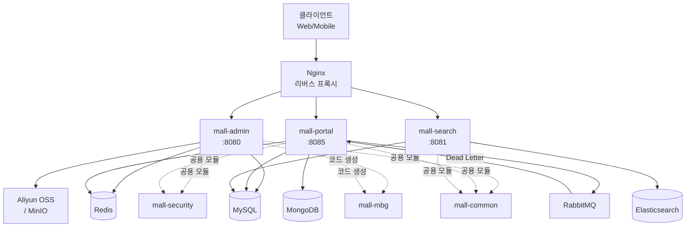
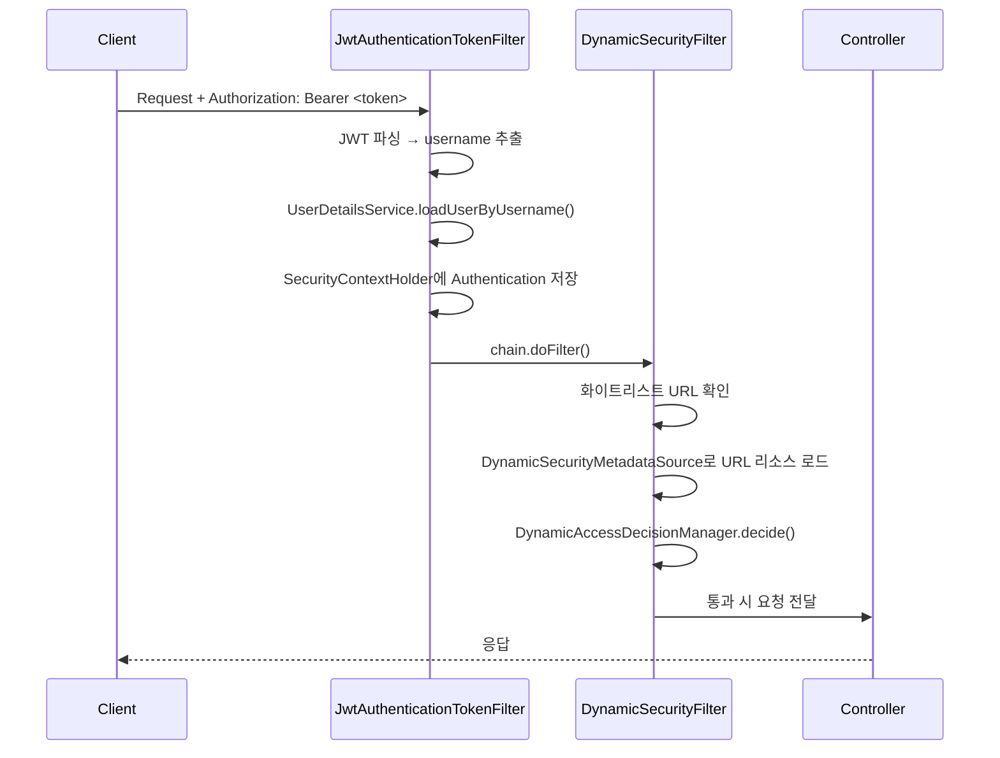
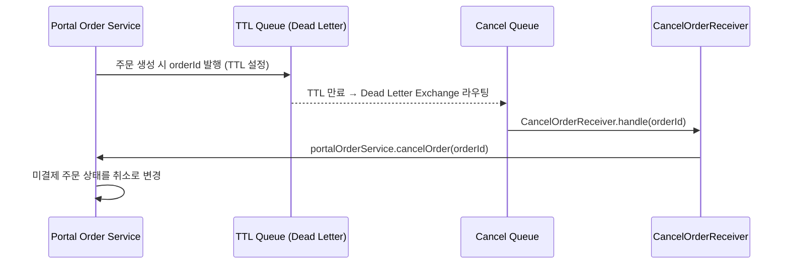

# mall - Codebase Documentation

## 1. 프로젝트 개요

`mall`은 중국의 macrozheng이 개발한 **완전한 전자상거래 백엔드 플랫폼**이다. 고객용 쇼핑몰 API와 관리자 백오피스 API로 구성된 모노레포 멀티모듈 Maven 프로젝트이며, 현업에서 실제로 사용되는 주류 기술 스택을 학습 목적으로도 적합하게 구현한 레퍼런스 아키텍처다.

| 항목 | 내용 |
|------|------|
| 언어 | Java 1.8 |
| 프레임워크 | Spring Boot 2.7.5 |
| 빌드 도구 | Maven (멀티모듈) |
| 라이선스 | Apache License 2.0 |
| 배포 방식 | Docker / Docker Compose / Jenkins |
| 패키지 그룹 | `com.macro.mall` |

---

## 2. 기술 스택 및 의존성

### 핵심 프레임워크

| 기술 | 버전 | 역할 |
|------|------|------|
| Spring Boot | 2.7.5 | 웹 애플리케이션 컨테이너 |
| Spring Security | (Boot 관리) | 인증·인가 프레임워크 |
| MyBatis | 3.5.10 | ORM (SQL Mapper) |
| MyBatis Generator | 1.4.1 | DB 코드 자동 생성 |
| PageHelper | 5.3.2 | MyBatis 페이징 플러그인 |

### 인프라 미들웨어

| 기술 | 버전 | 역할 |
|------|------|------|
| MySQL | 5.7 | 주 관계형 데이터베이스 |
| Redis | 7.0 | 세션 캐시·인증코드·주문 ID 관리 |
| Elasticsearch | 7.17.3 | 상품 풀텍스트 검색 엔진 |
| RabbitMQ | 3.10.5 | 주문 자동취소 비동기 메시지 큐 |
| MongoDB | 5.0 | 회원 열람 이력·관심 상품 NoSQL |
| Nginx | 1.22 | 리버스 프록시 / 정적 리소스 |

### 주요 라이브러리

| 라이브러리 | 버전 | 역할 |
|-----------|------|------|
| JJWT | 0.9.1 | JWT 토큰 생성·검증 |
| Druid | 1.2.14 | 데이터베이스 커넥션 풀 |
| Hutool | 5.8.9 | Java 유틸리티 집합 |
| Lombok | (Boot 관리) | 보일러플레이트 코드 제거 |
| Springfox Swagger | 3.0.0 | REST API 문서 자동 생성 |
| Logstash Logback Encoder | 7.2 | JSON 로그 → Logstash 전송 |
| MinIO SDK | 8.4.5 | 자체 호스팅 오브젝트 스토리지 |
| Aliyun OSS SDK | 2.5.0 | 알리클라우드 오브젝트 스토리지 |
| Alipay SDK | 4.38.61 | 알리페이 결제 연동 |
| JAXB API | 2.3.1 | JDK 11+ 호환성 보완 |

---

## 3. 프로젝트 구조

```
mall/
├── pom.xml                         # 루트 POM (멀티모듈 aggregator)
├── mall-common/                    # 공용 유틸 모듈
│   └── src/main/java/com/macro/mall/common/
│       ├── api/                    # CommonResult, CommonPage, ResultCode
│       ├── config/                 # Redis·Swagger 공용 설정
│       ├── domain/                 # WebLog, SwaggerProperties
│       ├── exception/              # ApiException, Asserts, GlobalExceptionHandler
│       ├── log/                    # WebLogAspect (AOP 로깅)
│       ├── service/                # RedisService
│       └── util/                   # RequestUtil
├── mall-mbg/                       # MyBatis Generator 코드 생성 모듈
│   └── src/main/java/com/macro/mall/
│       ├── Generator.java          # MBG 실행 진입점
│       ├── CommentGenerator.java   # 커스텀 주석 생성기
│       ├── mapper/                 # 자동 생성 Mapper 인터페이스 (76개)
│       └── model/                  # 자동 생성 엔티티 클래스
├── mall-security/                  # Spring Security 공용 모듈
│   └── src/main/java/com/macro/mall/security/
│       ├── annotation/             # @CacheException
│       ├── aspect/                 # RedisCacheAspect (캐시 예외 처리 AOP)
│       ├── component/              # JWT 필터, 동적 권한 필터·결정·메타데이터
│       ├── config/                 # SecurityConfig, RedisConfig, IgnoreUrlsConfig
│       └── util/                   # JwtTokenUtil, SpringUtil
├── mall-admin/                     # 관리자 백오피스 API 서버
│   └── src/main/java/com/macro/mall/
│       ├── MallAdminApplication.java
│       ├── bo/                     # AdminUserDetails (Spring Security UserDetails)
│       ├── config/                 # CORS, Security, MyBatis, OSS, Swagger 설정
│       ├── controller/             # REST 컨트롤러 (PMS/OMS/SMS/CMS/UMS)
│       ├── dao/                    # 커스텀 Mapper DAO
│       ├── dto/                    # 요청/응답 DTO
│       └── service/                # 비즈니스 서비스 계층
├── mall-portal/                    # 고객 쇼핑몰 API 서버
│   └── src/main/java/com/macro/mall/portal/
│       ├── MallPortalApplication.java
│       ├── component/              # RabbitMQ Sender/Receiver, 주문취소 Task
│       ├── config/                 # Alipay, CORS, Jackson, MyBatis, RabbitMQ, Swagger
│       ├── controller/             # REST 컨트롤러
│       ├── dao/                    # 커스텀 Mapper DAO
│       ├── domain/                 # 도메인 모델 (DTO, QueueEnum 등)
│       ├── service/                # 비즈니스 서비스
│       └── util/                   # DateUtil
├── mall-search/                    # Elasticsearch 검색 서버
│   └── src/main/java/com/macro/mall/search/
│       ├── MallSearchApplication.java
│       ├── config/                 # MyBatis, Swagger 설정
│       ├── controller/             # EsProductController
│       ├── dao/                    # EsProductDao (MyBatis XML)
│       ├── domain/                 # EsProduct, EsProductAttributeValue, EsProductRelatedInfo
│       ├── repository/             # EsProductRepository (Spring Data ES)
│       └── service/                # EsProductService + Impl
├── mall-demo/                      # 프레임워크 구성 테스트용 데모 모듈
└── document/                       # 각종 문서 및 SQL
    ├── sql/mall.sql                # 초기화 SQL 스크립트
    ├── docker/                     # Docker Compose 설정
    ├── postman/                    # API 테스트 컬렉션
    └── reference/                  # 배포 가이드
```

---

## 4. 핵심 아키텍처

### 4.1 시스템 전체 아키텍처



### 4.2 모듈 의존 관계

```
mall-common    ← (기반 유틸, 독립)
mall-mbg       ← (코드 생성, 독립)
mall-security  ← mall-common, mall-mbg
mall-admin     ← mall-common, mall-mbg, mall-security
mall-portal    ← mall-common, mall-mbg, mall-security
mall-search    ← mall-common, mall-mbg
```

### 4.3 인증·인가 플로우



### 4.4 RabbitMQ 주문 자동취소 플로우



---

## 5. 주요 파일 및 모듈 분석

### 5.1 mall-common

| 파일 | 역할 |
|------|------|
| `CommonResult<T>` | 모든 API 응답의 표준 래퍼 (code, message, data) |
| `CommonPage<T>` | PageHelper 결과를 표준 페이지 응답으로 변환 |
| `GlobalExceptionHandler` | `@ControllerAdvice` 전역 예외 처리 (ApiException, Validation, SQL) |
| `WebLogAspect` | AOP 기반 HTTP 요청/응답 로그 → Logstash JSON 포맷 출력 |
| `RedisService` | Redis 기본 연산 추상화 (String, List, Set, Hash, Expire) |
| `Asserts` | 조건 실패 시 `ApiException` throw 유틸 |

### 5.2 mall-security

| 파일 | 역할 |
|------|------|
| `JwtTokenUtil` | JWT 생성·파싱·검증 (HMAC-SHA512, 7일 만료) |
| `JwtAuthenticationTokenFilter` | `OncePerRequestFilter` - 매 요청마다 Bearer 토큰 검증 |
| `DynamicSecurityFilter` | URL 기반 동적 권한 필터 (`AbstractSecurityInterceptor`) |
| `DynamicSecurityMetadataSource` | DB에서 URL → 권한 매핑 정보 동적 로드 |
| `DynamicAccessDecisionManager` | `AffirmativeBased` 방식 접근 결정 |
| `DynamicSecurityService` | DB URL-권한 매핑 제공 인터페이스 (각 앱에서 구현) |
| `RedisCacheAspect` | `@CacheException` AOP - Redis 캐시 예외를 비치명적으로 처리 |
| `IgnoreUrlsConfig` | `application.yml`의 `secure.ignored.urls` 화이트리스트 바인딩 |
| `SecurityConfig` | `SecurityFilterChain` Bean 정의 (Stateless, JWT 필터 체인 구성) |

### 5.3 mall-mbg

76개 Mapper 인터페이스와 대응 Model 클래스를 자동 생성. 도메인 네임스페이스:

| 접두사 | 도메인 | 주요 테이블 예시 |
|--------|--------|----------------|
| `Pms*` | 상품 관리 (Product Management System) | `pms_product`, `pms_brand`, `pms_sku_stock` |
| `Oms*` | 주문 관리 (Order Management System) | `oms_order`, `oms_cart_item`, `oms_order_return_apply` |
| `Sms*` | 마케팅 관리 (Sales Management System) | `sms_coupon`, `sms_flash_promotion`, `sms_home_recommend` |
| `Ums*` | 회원 관리 (User Management System) | `ums_member`, `ums_member_receive_address` |
| `Cms*` | 콘텐츠 관리 (Content Management System) | `cms_subject`, `cms_help`, `cms_prefrence_area` |

### 5.4 mall-admin

**컨트롤러 목록 (도메인별):**

| 도메인 | 컨트롤러 예시 |
|--------|-------------|
| PMS (상품) | `PmsProductController`, `PmsBrandController`, `PmsProductCategoryController`, `PmsSkuStockController` |
| OMS (주문) | `OmsOrderController`, `OmsOrderReturnApplyController`, `OmsOrderSettingController` |
| SMS (마케팅) | `SmsCouponController`, `SmsFlashPromotionController`, `SmsHomeBrandController` |
| CMS (콘텐츠) | `CmsSubjectController`, `CmsPrefrenceAreaController` |
| 스토리지 | `OssController` (Aliyun OSS), `MinioController` (MinIO) |

### 5.5 mall-portal

**핵심 서비스:**

| 서비스 | 핵심 기능 |
|--------|---------|
| `OmsPortalOrderService` | 주문 확인 페이지 생성, 주문 생성 (재고 차감·쿠폰 적용·적립금 계산), 결제, 취소 |
| `OmsPromotionService` | 장바구니 아이템에 프로모션 규칙 적용 (쿠폰·플래시세일·적립금) |
| `UmsMemberService` | 회원가입, SMS 인증코드, JWT 로그인, 정보 조회 |
| `PmsPortalProductService` | 상품 상세 (속성·SKU·재고·프로모션 정보 통합) |
| `CancelOrderSender` | RabbitMQ TTL Queue에 주문취소 메시지 발행 |
| `CancelOrderReceiver` | Dead Letter Queue에서 주문취소 메시지 소비 |

### 5.6 mall-search

| 컴포넌트 | 역할 |
|---------|------|
| `EsProduct` | Elasticsearch 도큐먼트 모델 (`@Document`) |
| `EsProductRepository` | `ElasticsearchRepository` 기반 기본 CRUD |
| `EsProductServiceImpl` | 복합 검색 (FunctionScore, Bool Query, Aggregation), 필터·정렬·페이징 |
| `EsProductDao` | MyBatis로 MySQL에서 ES 색인용 데이터 조회 |

**검색 핵심 전략:**
- `FunctionScoreQueryBuilder`로 판매량·신상품에 가중치 부여
- `BoolQueryBuilder`로 키워드·브랜드·분류·속성 복합 필터
- `AggregationBuilders`로 브랜드·분류·속성 Facet 집계

---

## 6. 코드 품질 분석

### 6.1 강점

| 항목 | 평가 |
|------|------|
| 계층 분리 | Controller → Service → Mapper 3계층 일관 유지 |
| 공용 모듈화 | `mall-common`, `mall-security`, `mall-mbg`로 중복 배제 |
| 표준 응답 포맷 | `CommonResult<T>` 단일 API 응답 래퍼 전체 적용 |
| 전역 예외 처리 | `GlobalExceptionHandler`로 ApiException·Validation·SQL 예외 중앙화 |
| AOP 활용 | 로깅(`WebLogAspect`), Redis 예외(`RedisCacheAspect`) AOP 분리 |
| 비동기 처리 | RabbitMQ Dead Letter Queue 기반 주문 자동취소 |
| 동적 권한 | DB 기반 URL 권한 동적 로드 (재배포 없이 권한 변경 가능) |

### 6.2 개선 필요 사항

| 분류 | 문제점 | 심각도 |
|------|--------|--------|
| **보안** | `application.yml`에 JWT secret이 평문 하드코딩 (`mall-admin-secret`) | HIGH |
| **보안** | Aliyun OSS 키값이 `test`로 하드코딩 (실제 배포 시 노출 위험) | HIGH |
| **보안** | JJWT 0.9.1 사용 — 구버전, 알려진 취약점 존재 | MEDIUM |
| **테스트** | 테스트 코드가 Application 통합 테스트만 존재, 서비스 단위 테스트 없음 | HIGH |
| **아키텍처** | `mall-admin`과 `mall-portal`이 동일한 MBG Mapper를 직접 공유 (모듈 경계 약함) | MEDIUM |
| **코드 품질** | 중국어 주석이 다수 — 국제 협업 시 장벽 | LOW |
| **의존성** | Spring Boot 2.7.x (EOL 2025-11) → 3.x 마이그레이션 필요 | MEDIUM |
| **설정 관리** | 환경별 설정이 `application-dev.yml` / `application-prod.yml` 파일로만 분리 (Vault, ConfigServer 미사용) | MEDIUM |

### 6.3 코드 메트릭 추정

| 항목 | 값 |
|------|-----|
| Java 소스 파일 수 | 250+ |
| MBG 자동 생성 Mapper | 76개 |
| REST API 엔드포인트 | 120+ (admin ~80, portal ~30, search ~10) |
| 테스트 커버리지 | 약 5% (거의 없음) |

---

## 7. 개선 로드맵

### Phase 1 — 보안 강화 (즉시)

- [ ] JWT secret을 환경변수 / Vault로 외부화
- [ ] JJWT 0.12.x로 업그레이드 (HMAC-SHA 알고리즘 최신화)
- [ ] OSS 자격증명을 환경변수로 이동
- [ ] `prod` 프로파일에서 Swagger UI 비활성화

### Phase 2 — 테스트 강화

- [ ] 핵심 서비스 단위 테스트 작성 (Mockito 기반)
- [ ] `OmsPortalOrderService` 주문 생성 통합 테스트
- [ ] `EsProductService` 검색 단위 테스트

### Phase 3 — 기술 부채 해소

- [ ] Spring Boot 3.x + JDK 17 마이그레이션 (`dev-v3` 브랜치 참고)
- [ ] JJWT → Spring Security OAuth2 Resource Server 전환 검토
- [ ] Springfox Swagger → Springdoc OpenAPI 3.0 교체 (Springfox는 Boot 3 미지원)

### Phase 4 — 운영 성숙도

- [ ] Spring Cloud Config 또는 Vault 도입 (설정 중앙화)
- [ ] Resilience4j Circuit Breaker 적용 (Elasticsearch·RabbitMQ 장애 격리)
- [ ] Prometheus + Grafana 메트릭 수집 (`actuator` 이미 포함)
- [ ] 마이크로서비스 전환 시 `mall-swarm` (Spring Cloud Alibaba 버전) 참고

---

## 8. 개발 가이드

### 8.1 로컬 개발 환경 구성 최소 요건

`mall-admin`만 실행 시:
```
MySQL 5.7  → 포트 3306 (mall.sql 초기화)
Redis 7.0  → 포트 6379
```

전체 실행 시 추가:
```
MongoDB 5.0        → 포트 27017
RabbitMQ 3.10.5    → 포트 5672 / 15672
Elasticsearch 7.17 → 포트 9200 / 9300
Kibana 7.17        → 포트 5601
Logstash 7.17      → 포트 4560
```

### 8.2 환경 설정 파일 구조

```
src/main/resources/
├── application.yml         # 공통 설정 (프로파일 active: dev)
├── application-dev.yml     # 개발환경 DB/Redis/ES 연결 정보
└── application-prod.yml    # 운영환경 설정
```

### 8.3 빠른 시작

```bash
# 1. MySQL 초기화
mysql -u root -p < document/sql/mall.sql

# 2. mall-admin 실행 (MySQL + Redis만 있으면 됨)
cd mall-admin && mvn spring-boot:run

# 3. Swagger UI 접근
# http://localhost:8080/swagger-ui/index.html
```

### 8.4 MBG 코드 재생성

```bash
cd mall-mbg
mvn mybatis-generator:generate
# generatorConfig.xml 기준으로 mapper/model 재생성
```

### 8.5 API 공통 응답 포맷

```json
{
  "code": 200,
  "message": "操作成功",
  "data": { }
}
```

| code | 의미 |
|------|------|
| 200 | 성공 |
| 401 | 미인증 (JWT 없음/만료) |
| 403 | 권한 없음 |
| 404 | 리소스 없음 |
| 500 | 서버 오류 |

---

## 9. AI 어시스턴트 참고 섹션

> 이 프로젝트를 처음 다루는 AI 어시스턴트를 위한 핵심 컨텍스트

### 패키지 네이밍 규칙

- `Pms*` = Product Management System (상품)
- `Oms*` = Order Management System (주문)
- `Sms*` = Sales/Marketing Management System (마케팅·프로모션)
- `Ums*` = User/Member Management System (회원)
- `Cms*` = Content Management System (콘텐츠)
- `Es*` = Elasticsearch 관련

### 핵심 아키텍처 패턴

1. **공용 모듈 우선**: 새 유틸/예외/Redis 관련 코드는 `mall-common`, 보안 관련은 `mall-security`에 작성
2. **MBG Mapper는 수정 금지**: `mall-mbg`의 Mapper/Model은 자동 생성 파일. 커스텀 쿼리는 각 앱의 `dao/` 패키지에 별도 DAO 생성
3. **표준 응답 필수**: 모든 컨트롤러는 `CommonResult<T>` 반환
4. **JWT 흐름**: `Authorization: Bearer <token>` 헤더 → `JwtAuthenticationTokenFilter` → `SecurityContextHolder`
5. **동적 권한**: `DynamicSecurityService`를 구현해야 URL 기반 권한 필터 활성화됨

### 자주 실수하는 포인트

- `mall-admin`과 `mall-portal`은 **JWT secret이 별도** (`mall-admin-secret` vs `mall-portal-secret`)
- RabbitMQ 주문 취소는 **TTL Dead Letter Queue** 패턴 — 직접 스케줄러가 아님
- Elasticsearch 검색 구현이 Spring Data ES Repository + `ElasticsearchRestTemplate` 혼용 (단순 CRUD는 Repository, 복합 검색은 Template 사용)
- 페이징은 **PageHelper** (MyBatis 플러그인) 사용 — JPA Pageable과 다름: `PageHelper.startPage(pageNum, pageSize)` 후 쿼리 실행
- MongoDB는 `portal`에서만 사용: 회원 열람 이력(`MemberReadHistory`), 관심 브랜드(`MemberBrandAttention`), 관심 상품(`MemberProductCollection`)

### 파일 수정 시 주의사항

- `application-prod.yml`에 실제 운영 자격증명 없음 (테스트값) — 실 배포 전 반드시 교체
- `secure.ignored.urls`에 새 공개 엔드포인트 추가 필요 시 `application.yml` 수정
- Docker 이미지 빌드 시 `docker.host` 프로퍼티에 Docker Remote API 주소 필요
