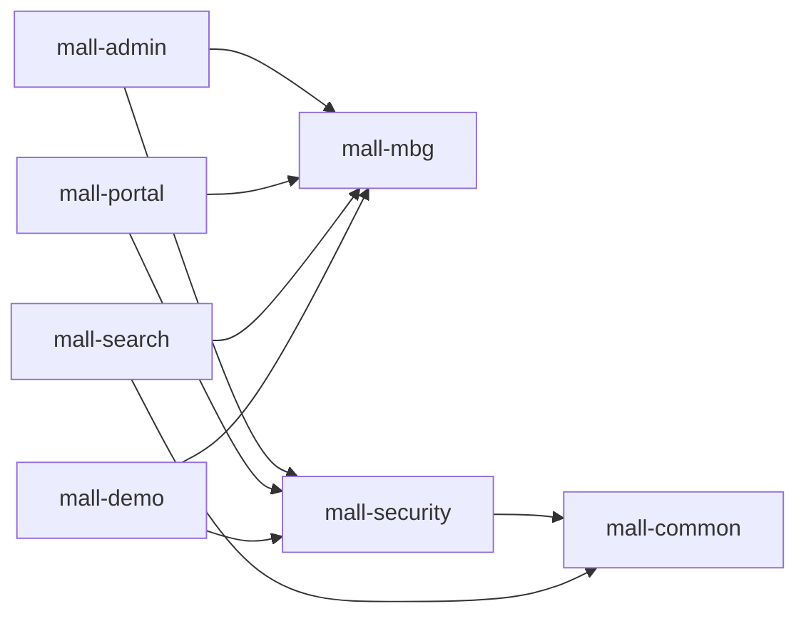
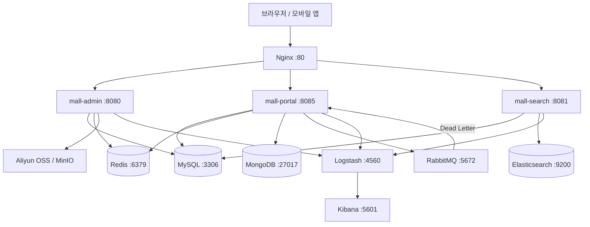
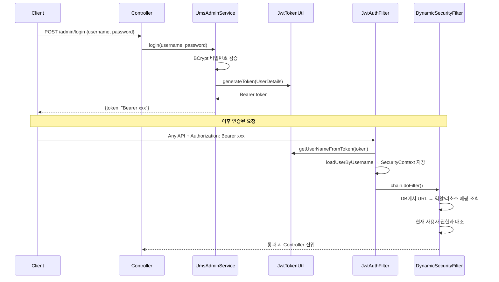
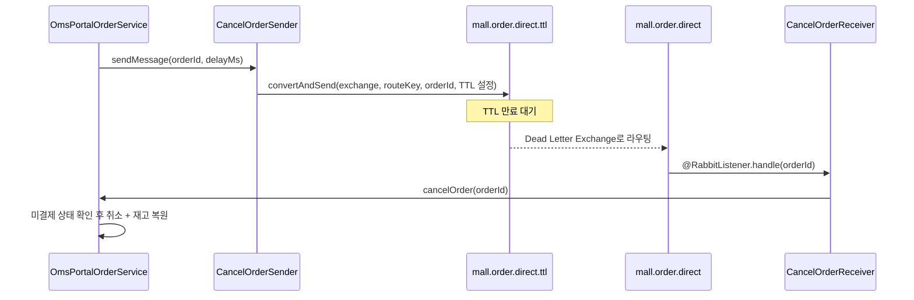

# mall - Codebase Documentation

## 1. 프로젝트 개요

`mall`은 macrozheng이 개발한 오픈소스 풀스택 전자상거래 플랫폼입니다. Spring Boot + MyBatis 기반의 멀티모듈 모놀리식 아키텍처로, 관리자 백오피스(mall-admin)와 고객 쇼핑몰(mall-portal), 검색 서버(mall-search)를 단일 레포지토리에서 제공합니다. 실무 수준의 기술 스택을 학습하기 위한 레퍼런스 아키텍처로 널리 사용됩니다.

| 항목 | 내용 |
|------|------|
| 언어 / 플랫폼 | Java 1.8 / Spring Boot 2.7.5 |
| 아키텍처 | 멀티모듈 모놀리스 (Maven) |
| 패키지 그룹 | `com.macro.mall` |
| 라이선스 | Apache License 2.0 |
| 포트 구성 | mall-admin: 8080 / mall-portal: 8085 / mall-search: 8081 |
| 마이크로서비스 버전 | mall-swarm (Spring Cloud Alibaba, 별도 레포) |

### 핵심 기능 도메인

| 접두사 | 도메인 | 주요 기능 |
|--------|--------|---------|
| PMS | Product Management System | 브랜드, 카테고리, 상품, SKU, 속성, 앨범 |
| OMS | Order Management System | 장바구니, 주문 생성/처리/반품, 배송 |
| UMS | User Management System | 회원/관리자 인증, 등급, 쿠폰, 포인트 |
| SMS | Sales Management System | 플래시세일, 쿠폰, 홈 광고/추천 |
| CMS | Content Management System | 주제, 도움말, 선호 영역, 회원 신고 |

---

## 2. 기술 스택 및 의존성

### 백엔드 핵심 스택

| 기술 | 버전 | 용도 |
|------|------|------|
| Spring Boot | 2.7.5 | 웹 애플리케이션 컨테이너 |
| Spring Security | (Boot 관리) | JWT 기반 인증 / 동적 URL 권한 |
| MyBatis | 3.5.10 | ORM (SQL Mapper) |
| MyBatis Generator | 1.4.1 | DB 스키마 → Java 코드 자동 생성 |
| PageHelper | 5.3.2 | MyBatis 물리 페이지네이션 |
| Druid | 1.2.14 | 커넥션 풀 + 모니터링 대시보드 |
| JJWT | 0.9.1 | JWT 토큰 생성·파싱·검증 (HMAC-SHA512) |
| Springfox Swagger | 3.0.0 | REST API 문서 자동화 |
| Hutool | 5.8.9 | Java 범용 유틸리티 라이브러리 |
| Lombok | (Boot 관리) | 보일러플레이트 코드 생성 |
| JAXB API | 2.3.1 | JDK 11+ 호환성 패치용 |

### 인프라 / 미들웨어

| 기술 | 버전 | 용도 |
|------|------|------|
| MySQL | 5.7 | 주 관계형 데이터베이스 (76개 테이블) |
| Redis | 7.0 | 캐시(관리자/회원 정보), 인증코드, 주문 ID 시퀀스 |
| MongoDB | 5.0 | 회원 행동 데이터 (열람/관심/찜 이력) |
| Elasticsearch | 7.17.3 | 상품 풀텍스트 검색 엔진 |
| RabbitMQ | 3.9.11 | 주문 자동취소 TTL Dead Letter Queue |
| MinIO | 8.4.5 | 자체 호스팅 오브젝트 스토리지 |
| Aliyun OSS | 2.5.0 | 클라우드 오브젝트 스토리지 (선택) |
| Nginx | 1.22 | 리버스 프록시 / 정적 파일 서빙 |
| Logstash | 7.17.3 | 애플리케이션 로그 수집 |
| Kibana | 7.17.3 | 로그 시각화 |

### 프론트엔드 (별도 레포지토리)

| 기술 | 용도 |
|------|------|
| Vue.js + Vuex + Vue-router + Element UI | 관리자 백오피스 SPA (mall-admin-web) |
| uni-app + luch-request | 모바일 쇼핑몰 크로스플랫폼 앱 (mall-app-web) |

---

## 3. 프로젝트 구조

```
mall/
├── pom.xml                          # 루트 BOM — 버전 관리, 공통 의존성 선언
├── mall-common/                     # 공용 유틸리티 모듈 (독립)
│   └── api/                         #   CommonResult, CommonPage, ResultCode
│   └── exception/                   #   ApiException, Asserts, GlobalExceptionHandler
│   └── log/                         #   WebLogAspect (AOP 요청 로깅)
│   └── service/                     #   RedisService 인터페이스 + 구현
├── mall-mbg/                        # MyBatisGenerator 코드 생성 모듈 (독립)
│   └── Generator.java               #   MBG 실행 진입점
│   └── mapper/                      #   자동 생성 Mapper 인터페이스 (76개)
│   └── model/                       #   자동 생성 Entity + Example 클래스
├── mall-security/                   # Spring Security 공용 모듈
│   └── component/                   #   JWT 필터, 동적 권한 필터/결정/메타데이터
│   └── config/                      #   SecurityConfig, IgnoreUrlsConfig, RedisConfig
│   └── util/                        #   JwtTokenUtil, SpringUtil
│   └── aspect/                      #   RedisCacheAspect (@CacheException AOP)
├── mall-admin/                      # 백오피스 API 서버 (포트: 8080)
│   └── controller/                  #   35개 REST 컨트롤러
│   └── service/ + service/impl/     #   비즈니스 서비스
│   └── dao/                         #   복잡 쿼리용 커스텀 DAO
│   └── dto/                         #   요청/응답 DTO
│   └── config/                      #   CORS, Security, MyBatis, OSS, Swagger
├── mall-portal/                     # 고객 쇼핑몰 API 서버 (포트: 8085)
│   └── controller/                  #   14개 REST 컨트롤러
│   └── service/ + service/impl/     #   비즈니스 서비스
│   └── component/                   #   RabbitMQ CancelOrder Sender/Receiver
│   └── repository/                  #   MongoDB Repository
│   └── domain/                      #   도메인 객체, QueueEnum
│   └── config/                      #   Alipay, RabbitMQ, Jackson, Swagger 등
├── mall-search/                     # Elasticsearch 검색 서버 (포트: 8081)
│   └── controller/                  #   EsProductController
│   └── service/impl/                #   EsProductServiceImpl (복합 검색 로직)
│   └── repository/                  #   EsProductRepository (Spring Data ES)
│   └── dao/                         #   EsProductDao (MySQL → ES 데이터 조회)
│   └── domain/                      #   EsProduct, EsProductAttributeValue
├── mall-demo/                       # 프레임워크 데모 / 학습용 모듈
└── document/
    ├── sql/mall.sql                 # 전체 DB 스키마 + 초기 데이터 (3,257줄, 76 테이블)
    ├── docker/docker-compose-env.yml  # 인프라 컨테이너 구성
    ├── docker/docker-compose-app.yml  # 앱 컨테이너 구성
    ├── postman/                     # Postman API 컬렉션 (admin/portal)
    ├── axure/                       # UI/UX 프로토타입
    ├── reference/                   # 배포 / 운영 가이드
    └── elk/logstash.conf            # Logstash 파이프라인 설정
```

### 모듈 의존 관계



---

## 4. 핵심 아키텍처

### 시스템 아키텍처 개요



### 레이어드 아키텍처

모든 모듈(admin/portal/search)은 동일한 4계층 구조를 따릅니다.

```
Request
  ↓
Controller (@RestController)
  — DTO 변환, 입력 유효성 검증 (@Valid)
  — CommonResult<T> 응답 래핑
  ↓
Service (Interface + Impl)
  — 비즈니스 로직, 트랜잭션 경계
  — Redis/MongoDB/ES 직접 접근
  ↓
  ┌─────────────────────────────────────────────┐
  │ MBG Mapper (자동 생성, 단순 CRUD + Example)   │
  │ Custom DAO (복잡 JOIN, 다중 테이블 집계 쿼리)  │
  └─────────────────────────────────────────────┘
  ↓
MySQL (Druid 커넥션 풀)
```

### 인증 아키텍처 (JWT Stateless)



- 토큰 만료: 7일 (604,800초)
- 알고리즘: HMAC-SHA512
- admin/portal 각각 독립된 secret 키
- Stateless: DB/Redis에 세션 저장 없음

### 주문 자동취소 아키텍처 (RabbitMQ TTL Dead Letter)



### Elasticsearch 검색 흐름

```
상품 등록/수정 (mall-admin)
  ↓ (수동 동기화 또는 별도 API 호출)
EsProductService.importAll() / create(id)
  → EsProductDao: MySQL JOIN 쿼리로 상품+속성+SKU 조회
  → EsProductRepository.saveAll() → ES 인덱싱 (인덱스: pms)

검색 요청 (mall-search)
  → EsProductServiceImpl.search(keyword, brandId, ...)
  → BoolQueryBuilder (키워드 멀티필드, 브랜드/카테고리 필터)
  → FunctionScoreQuery (판매량/신상품 가중치 부스팅)
  → AggregationBuilders (브랜드/카테고리/속성 Facet)
  → 검색 결과 + 집계 정보 반환
```

---

## 5. 주요 파일 및 모듈 분석

### mall-common — 공통 기반 모듈

| 클래스 | 역할 |
|--------|------|
| `CommonResult<T>` | 전체 API 표준 응답 래퍼. `code/message/data` 필드, 정적 팩토리 메서드 제공 |
| `CommonPage<T>` | PageHelper `PageInfo`를 표준 페이지 응답으로 변환 (total, pageNum, pageSize 포함) |
| `ResultCode` | HTTP 유사 응답 코드 열거형 (SUCCESS=200, FAILED=500, UNAUTHORIZED=401, FORBIDDEN=403, VALIDATE_FAILED=404) |
| `GlobalExceptionHandler` | `@ControllerAdvice` - ApiException, MethodArgumentNotValidException, BindException 중앙 처리 |
| `WebLogAspect` | `@Around` AOP - 모든 Controller 메서드 요청/응답 JSON 로그 (URI, method, args, result, time) |
| `RedisService` | Redis 작업 추상화 — String/Hash/List/Set 연산, Expire 관리 |
| `Asserts` | 조건 기반 예외 throw 유틸 (`fail(IErrorCode)`) |

### mall-security — 보안 공용 모듈

| 클래스 | 역할 |
|--------|------|
| `JwtTokenUtil` | JWT 생성/파싱/갱신/만료 검증. 30분 내 재발급 시 기존 토큰 재사용 최적화 |
| `JwtAuthenticationTokenFilter` | `OncePerRequestFilter` - 매 요청 Bearer 토큰 파싱 → SecurityContext 설정 |
| `DynamicSecurityFilter` | `AbstractSecurityInterceptor` 구현체 - URL 기반 동적 접근 제어 |
| `DynamicSecurityMetadataSource` | DB의 `ums_resource` 테이블에서 URL → 권한 매핑 동적 로드 |
| `DynamicAccessDecisionManager` | 요청 URL의 필요 권한과 현재 사용자 권한 비교 결정 |
| `DynamicSecurityService` | 각 앱 모듈에서 구현해야 하는 권한 데이터 제공 인터페이스 |
| `RedisCacheAspect` | `@CacheException` AOP - Redis 장애 시 예외를 삼키고 비즈니스 로직 계속 진행 |
| `SecurityConfig` | `SecurityFilterChain` Bean - Stateless, CSRF 비활성, JWT 필터 체인 구성 |
| `IgnoreUrlsConfig` | `secure.ignored.urls` YAML 바인딩 — 인증 불필요 URL 목록 관리 |

### mall-mbg — 코드 생성 모듈

MBG(MyBatis Generator)로 자동 생성된 Mapper 인터페이스 76개, 대응 Model + Example 클래스.
`Generator.java`를 실행하면 `generatorConfig.xml` 기준으로 재생성됩니다.

도메인별 주요 테이블:

| 도메인 | 테이블 수 | 대표 테이블 |
|--------|----------|-----------|
| PMS | 18 | `pms_product`, `pms_brand`, `pms_sku_stock`, `pms_product_category` |
| OMS | 10 | `oms_order`, `oms_cart_item`, `oms_order_return_apply`, `oms_order_item` |
| UMS | 22 | `ums_member`, `ums_admin`, `ums_role`, `ums_resource`, `ums_menu` |
| SMS | 10 | `sms_coupon`, `sms_flash_promotion`, `sms_home_recommend_product` |
| CMS | 12 | `cms_subject`, `cms_help`, `cms_prefrence_area`, `cms_topic` |
| 기타 | 4 | 관계 테이블 등 |

### mall-admin — 백오피스 API 서버

35개 컨트롤러, 도메인별 분류:

| 도메인 | 주요 컨트롤러 |
|--------|-------------|
| 상품(PMS) | `PmsProductController`, `PmsBrandController`, `PmsProductCategoryController`, `PmsSkuStockController`, `PmsProductAttributeController` |
| 주문(OMS) | `OmsOrderController`, `OmsOrderReturnApplyController`, `OmsOrderSettingController`, `OmsCompanyAddressController` |
| 마케팅(SMS) | `SmsCouponController`, `SmsFlashPromotionController`, `SmsHomeAdvertiseController`, `SmsHomeBrandController` |
| 콘텐츠(CMS) | `CmsSubjectController`, `CmsPrefrenceAreaController` |
| 권한/회원(UMS) | `UmsAdminController`, `UmsRoleController`, `UmsMenuController`, `UmsResourceController` |
| 스토리지 | `OssController` (Aliyun OSS), `MinioController` (MinIO) |

핵심 서비스 구현체:

- **`UmsAdminServiceImpl`**: BCrypt 비밀번호 검증, JWT 발급, Redis 캐시(ums:admin 키), 로그인 이력 기록
- **`PmsProductServiceImpl`**: 상품 생성/수정 시 SKU, 속성값, 가격, 사진, 카테고리 관계를 트랜잭션 내에서 일괄 처리
- **`OmsOrderServiceImpl`**: 주문 조회/발송 처리/닫기/삭제/환불 처리, 운영자 조작 이력 기록

### mall-portal — 고객 쇼핑몰 API 서버

핵심 서비스:

| 서비스 | 핵심 비즈니스 |
|--------|-------------|
| `OmsPortalOrderServiceImpl` | 주문 확인 페이지 생성, 주문 생성 (재고 차감 + 쿠폰 적용 + 포인트 사용), 결제 확인, 취소, 완료, 반품 신청 |
| `OmsPromotionServiceImpl` | 장바구니 아이템에 쿠폰/플래시세일/포인트/계단식 할인 규칙을 적용하는 프로모션 계산 엔진 |
| `UmsMemberServiceImpl` | 회원 가입, SMS 인증코드 발송/검증(Redis), JWT 로그인, 포인트/성장치 변경 |
| `PmsPortalProductServiceImpl` | 상품 상세 페이지 (SKU + 재고 + 속성 + 프로모션 정보 통합 조회) |
| `HomeServiceImpl` | 홈 화면 (플래시세일 + 신상품 + 추천상품 + 광고 + 브랜드 일괄 조회) |

RabbitMQ 구성 (`QueueEnum`):
- `mall.order.direct.ttl` exchange → TTL 큐 (`mall.order.cancel.ttl`): 주문 만료 대기
- `mall.order.direct` exchange → Dead Letter 큐 (`mall.order.cancel`): 실제 취소 처리

MongoDB Repository (행동 데이터 전용):
- `MemberReadHistoryRepository`: 상품 열람 기록
- `MemberBrandAttentionRepository`: 관심 브랜드
- `MemberProductCollectionRepository`: 상품 찜 목록

### mall-search — 검색 서버

| 컴포넌트 | 역할 |
|---------|------|
| `EsProduct` | ES 도큐먼트 모델 (`@Document(indexName = "pms")`). 상품 + 속성값 + 브랜드/카테고리 중첩 구조 |
| `EsProductRepository` | `ElasticsearchRepository` — 기본 CRUD, 단순 키워드 검색 |
| `EsProductServiceImpl` | `ElasticsearchRestTemplate` 기반 복합 검색: FunctionScoreQuery, BoolQuery, Aggregation |
| `EsProductDao` | MyBatis XML — MySQL에서 ES 인덱싱용 상품+속성 JOIN 조회 |
| `EsProductController` | `importAll`, `create`, `delete`, `search`, `recommend` API |

검색 구현 핵심:
- `FunctionScoreQueryBuilder` + `ScoreFunctionBuilders.weightFactorFunction()`: 판매량/신상품에 가중치 부여
- `BoolQueryBuilder`: 키워드(멀티필드), 브랜드, 카테고리, 가격 범위 필터
- `AggregationBuilders.terms()` + `nested()`: 브랜드/카테고리/속성 Facet 집계
- `SortBuilders`: 가격/새순 정렬 지원

---

## 6. 코드 품질 분석

### 강점

| 항목 | 평가 |
|------|------|
| 도메인 분리 | PMS/OMS/UMS/SMS/CMS 접두어로 전 코드가 도메인별 정렬. 탐색 직관적 |
| 공통 응답 규격 | `CommonResult<T>` 전 API 적용으로 응답 일관성 보장 |
| 보안 모듈화 | `mall-security` 독립 모듈 — admin/portal 재사용, 수정 영향 범위 명확 |
| AOP 활용 | 로깅(`WebLogAspect`), Redis 장애 허용(`RedisCacheAspect`) AOP 분리 |
| 비동기 주문취소 | RabbitMQ TTL Dead Letter Queue로 주문 만료 처리 — 폴링 없이 이벤트 기반 |
| 동적 권한 | DB 기반 URL-역할 매핑 — 재배포 없이 권한 변경 가능 |
| 코드 생성 | MBG로 76개 테이블의 반복 CRUD 자동화, 개발자는 비즈니스 로직에 집중 |

### 개선 필요 사항

| 분류 | 문제점 | 심각도 |
|------|--------|--------|
| 보안 | `jwt.secret: mall-admin-secret` 평문 하드코딩 | HIGH |
| 보안 | OSS accessKeyId/Secret이 `test`로 하드코딩 | HIGH |
| 보안 | JJWT 0.9.1 — 구버전, 최신 보안 패치 미적용 | MEDIUM |
| 테스트 | 단위 테스트 거의 없음. mall-search Application 통합 테스트 1개만 존재 | HIGH |
| 아키텍처 | admin/portal이 동일한 MBG Mapper에 직접 의존 (도메인 경계 약함) | MEDIUM |
| 의존성 | Spring Boot 2.7.x (EOL 2025-11), JDK 8 — 최신 LTS(21) 대비 기능 제한 | MEDIUM |
| 코드 품질 | 일부 서비스 구현체(OmsPortalOrderServiceImpl 등) 수백 줄 — 단일 책임 위반 가능성 | MEDIUM |
| 동기화 | Elasticsearch와 MySQL 데이터 동기화가 수동 — 실시간성 보장 어려움 | MEDIUM |
| 국제화 | 소스 내 중국어 주석 다수 — 다국어 협업 시 장벽 | LOW |

### 코드 규모 추정

| 항목 | 수치 |
|------|-----|
| Java 소스 파일 | 250+ 개 |
| MBG 자동 생성 Mapper | 76개 |
| REST API 엔드포인트 | 120+ 개 (admin ~80, portal ~30, search ~10) |
| DB 테이블 | 76개 (SQL 3,257줄) |
| 테스트 파일 | 1개 (Application 통합 테스트) |

---

## 7. 개선 로드맵

### Phase 1 — 보안 강화 (즉시 적용)

1. **Secret 외부화**: `jwt.secret`, DB 패스워드, OSS 키를 환경변수 또는 Spring Cloud Config/Vault로 이동
2. **JJWT 업그레이드**: 0.9.1 → 0.12.x (API 변경에 따른 코드 수정 필요)
3. **운영 환경 Swagger 비활성화**: `application-prod.yml`에 `springfox.documentation.enabled: false` 추가

### Phase 2 — 테스트 기반 마련

4. 핵심 서비스 단위 테스트 작성 (Mockito 기반): `UmsAdminService`, `OmsPortalOrderService`, `PmsProductService`
5. `EsProductService` 검색 로직 단위 테스트
6. `OmsPortalOrderService.generateOrder()` 프로모션 계산 통합 테스트

### Phase 3 — 기술 부채 해소

7. **ES-DB 동기화 자동화**: `PmsProductService` 저장/수정 시 `EsProductService.create()` 자동 호출
8. **Springfox → Springdoc**: Boot 3 미지원 Springfox를 SpringDoc OpenAPI 3.0으로 교체
9. **Spring Boot 3.x + JDK 17**: `dev-v3` 브랜치 전략 채택. 패키지 변경(`javax` → `jakarta`) 대응 필요

### Phase 4 — 운영 성숙도

10. Prometheus + Grafana 메트릭 수집 (`spring-boot-actuator` 이미 포함)
11. Resilience4j Circuit Breaker — Elasticsearch/RabbitMQ 장애 격리
12. 마이크로서비스 전환: `mall-swarm` (Spring Cloud Alibaba) 레포지토리 참고

---

## 8. 개발 가이드

### 로컬 최소 실행 (mall-admin)

```bash
# 1. MySQL 스키마 초기화
mysql -u root -p < document/sql/mall.sql

# 2. application-dev.yml 수정 (DB/Redis 연결 정보)

# 3. 실행
cd mall-admin && mvn spring-boot:run
# Swagger UI: http://localhost:8080/swagger-ui/index.html
```

### 전체 인프라 Docker Compose 실행

```bash
# 인프라 (MySQL, Redis, MongoDB, RabbitMQ, Elasticsearch, Logstash, Kibana, MinIO)
docker-compose -f document/docker/docker-compose-env.yml up -d

# 애플리케이션
docker-compose -f document/docker/docker-compose-app.yml up -d
```

### 새 기능 추가 패턴

1. `mall-mbg`의 `generatorConfig.xml`에 테이블 추가 후 `Generator.java` 실행 → Mapper/Model 자동 생성
2. 해당 앱 모듈 `service/` 에 Interface + Impl 작성
3. `controller/` 에 `@RestController` + `@Api` 추가 (CommonResult 반환)
4. 공개 API는 `application.yml`의 `secure.ignored.urls`에 추가

### MBG 코드 재생성

```bash
cd mall-mbg
# generatorConfig.xml에 테이블 추가 후
mvn mybatis-generator:generate
# mapper/, model/ 하위 파일이 자동 생성/갱신됨
```

### 환경별 설정 파일 구조

```
src/main/resources/
├── application.yml           # 공통 설정 (프로파일 기본값: dev)
├── application-dev.yml       # 개발환경 DB/Redis/ES 주소, 로깅 레벨
└── application-prod.yml      # 운영환경 설정 (외부화 권장)
```

### 공통 API 응답 포맷

```json
{
  "code": 200,
  "message": "操作成功",
  "data": { ... }
}
```

| code | 의미 |
|------|------|
| 200 | 성공 |
| 401 | 미인증 (JWT 없음 또는 만료) |
| 403 | 권한 없음 |
| 404 | 파라미터 검증 실패 |
| 500 | 서버 내부 오류 |

---

## 9. AI 어시스턴트 참고 섹션

### 코드 탐색 진입점

| 목적 | 파일 |
|------|------|
| 인증 흐름 이해 | `mall-security/component/JwtAuthenticationTokenFilter.java` |
| 동적 권한 이해 | `mall-security/component/DynamicSecurityFilter.java` + `DynamicSecurityMetadataSource.java` |
| 새 REST API 예시 | `mall-admin/controller/PmsBrandController.java` + `service/impl/PmsBrandServiceImpl.java` |
| 가장 복잡한 서비스 | `mall-portal/service/impl/OmsPortalOrderServiceImpl.java` |
| ES 검색 구현 | `mall-search/service/impl/EsProductServiceImpl.java` + `dao/EsProductDao.java` |
| 공통 응답 패턴 | `mall-common/api/CommonResult.java` |
| DB 스키마 전체 | `document/sql/mall.sql` |

### 프로젝트 고유 관행 (비표준 패턴)

**MBG Example 클래스**: `PmsBrandExample`, `OmsOrderExample` 같은 Example 클래스는 WHERE 조건 빌더입니다. `example.createCriteria().andStatusEqualTo(1)` 형태로 사용합니다. JPA Specification과 유사하나 MyBatis 전용입니다.

**캐시 서비스 분리 패턴**: `UmsAdminCacheService`, `UmsMemberCacheService` 인터페이스가 Redis 캐시 작업만 전담합니다. `@CacheException` 어노테이션이 붙은 메서드는 Redis 예외를 무시하여 캐시 장애가 서비스를 멈추지 않도록 합니다.

**동적 권한 활성화 조건**: `DynamicSecurityService` Bean이 등록되어 있을 때만 `DynamicSecurityFilter`가 활성화됩니다. `mall-admin`은 구현체를 등록하지만 `mall-portal`은 등록하지 않습니다.

**포털 DAO의 역할**: `mall-portal/dao/` 하위 DAO는 MBG Mapper가 지원하지 않는 다중 테이블 JOIN 쿼리를 담당합니다. `classpath:dao/*.xml` 경로로 XML 매핑을 로드합니다.

**PageHelper 페이징**: JPA의 `Pageable`과 달리 `PageHelper.startPage(pageNum, pageSize)` 호출 직후 실행되는 첫 번째 쿼리에 페이징이 자동 적용됩니다.

### 변경 시 주의사항

- **MBG 파일 수정 금지**: `mall-mbg/mapper/`, `mall-mbg/model/` 파일은 재생성 시 덮어쓰입니다. 커스텀 쿼리는 해당 앱의 `dao/` 패키지에 별도 DAO로 작성하세요.
- **mall-security 변경 영향 범위**: `SecurityConfig`, `JwtTokenUtil` 수정은 admin/portal 양쪽에 영향을 미칩니다. 반드시 양쪽 모듈을 테스트하세요.
- **admin/portal JWT secret 분리**: `mall-admin-secret`(admin)과 `mall-portal-secret`(portal)은 서로 다른 secret을 사용합니다. 토큰은 발급한 서비스에서만 유효합니다.
- **Swagger + Spring Boot 2.6+ 호환**: `spring.mvc.pathmatch.matching-strategy: ant_path_matcher` 설정이 없으면 Springfox 3.0이 기동 시 `NumberFormatException`으로 실패합니다. 이 설정을 제거하지 마세요.
- **MongoDB는 portal 전용**: MongoDB는 `mall-portal`에서만 사용합니다. mall-admin/mall-search에는 MongoDB 의존성이 없습니다.
- **ES 인덱스 수동 동기화**: 상품을 admin에서 생성/수정해도 ES 인덱스는 자동 업데이트되지 않습니다. `/search/importAll` API를 별도로 호출해야 합니다.
